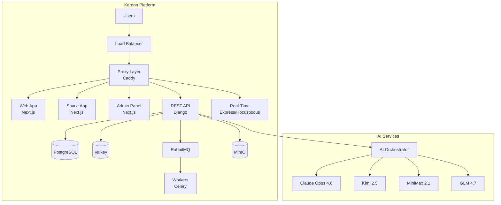

# Kardon Platform Documentation

<p align="center">
  <a href="https://kardon.so">
    
  </a>
</p>

<h3 align="center"><b>Kardon Platform Documentation</b></h3>
<p align="center"><b>Open-source, self-hosted project management tool with AI integration</b></p>

---

## 📚 Documentation Index

### 🚀 Getting Started

- **[Docker Compose Setup Guide](deployment/docker-compose/README.md)** - Complete guide to set up Kardon using Docker Compose
- **[Quick Start](deployment/docker-compose/quick-start.md)** - Get up and running in 10 minutes

### 🏗️ Architecture

- **[Architecture Overview](architecture/README.md)** - High-level system architecture and design principles
- **[Detailed Architecture](architecture/detailed.md)** - In-depth component breakdown and data flows
- **[Technology Stack](architecture/technology-stack.md)** - Technologies used and why

### 🔒 Security & Compliance

- **[Security Overview](security/README.md)** - Security architecture and features
- **[GDPR Compliance](security/gdpr.md)** - How to achieve GDPR compliance with Kardon
- **[SOC 2 Compliance](security/soc2.md)** - SOC 2 Type II controls and implementation
- **[Data Protection](security/data-protection.md)** - Encryption, data handling, and privacy

### 🤖 AI Integration

- **[AI Integration Guide](ai/README.md)** - Overview of supported AI models
- **[Claude Integration](ai/claude.md)** - Anthropic Claude Opus 4.6 and family
- **[Chinese AI Models](ai/chinese-models.md)** - Kimi 2.5, MiniMax 2.1, GLM 4.7
- **[Local AI Deployment](ai/local-deployment.md)** - Run AI models locally for privacy
- **[Cost Management](ai/cost-management.md)** - Budgeting and cost optimization

### ✨ Features

- **[Current Features](features/README.md)** - Existing platform capabilities
- **[Future Features](features/future.md)** - Planned enhancements (chat, agents)
- **[Real-time Collaboration](features/realtime.md)** - WebSocket-based collaboration

---

## 📖 What is Kardon?

Kardon is an open-source project management platform designed to help teams collaborate effectively. Key characteristics include:

- **Self-Hosted** - Run on your own infrastructure for complete data control
- **AI-Ready** - Integrated with state-of-the-art AI models for enhanced productivity
- **Real-Time Collaboration** - Live editing, presence, and instant updates
- **GDPR & SOC 2 Compliant** - Enterprise-grade security and privacy features
- **Cost-Effective AI** - Support for budget-friendly Chinese models (Kimi, MiniMax, GLM)

---

## 🏗️ Architecture Overview



---

## 🚀 Quick Start

### Prerequisites

- Docker Engine 24.0+
- Docker Compose v2.20+
- Git
- 16GB RAM minimum (32GB recommended)
- 50GB free disk space

### Installation

```bash
# 1. Clone the repository
git clone https://github.com/H3xKatana/microhack-kardon.git
cd microhack-kardon

# 2. Run setup script
bash setup.sh

# 3. Start services with Docker Compose
docker compose -f docker-compose-local.yml up -d

# 4. Access the platform
# Web App: http://localhost:3000
# API Docs: http://localhost:8000/api/docs/
# MinIO Console: http://localhost:9090
```

---

## 🤖 Supported AI Models

Kardon integrates with multiple state-of-the-art AI models to provide the best balance of capability, speed, and cost:

### Enterprise-Grade Models

| Model               | Provider  | Context   | Best For                  | Cost          |
| ------------------- | --------- | --------- | ------------------------- | ------------- |
| **Claude Opus 4.6** | Anthropic | 1M tokens | Complex reasoning, agents | $15/$75 per M |
| **GPT-4.5**         | OpenAI    | 2M tokens | General purpose, coding   | $10/$30 per M |

### Cost-Effective Models (Up to 98% Savings)

| Model           | Provider    | Context     | Best For                | Cost              |
| --------------- | ----------- | ----------- | ----------------------- | ----------------- |
| **Kimi 2.5**    | Moonshot AI | 262K tokens | Agent swarm, multimodal | $0.60/$3.00 per M |
| **MiniMax 2.1** | MiniMax     | 1M tokens   | Coding, agents          | $0.30/$1.20 per M |
| **GLM 4.7**     | Zhipu AI    | 200K tokens | Agentic coding          | $0.28/$2.27 per M |

### Local Models

Kardon also supports running AI models locally using Ollama or vLLM for:

- Complete data privacy
- No API costs
- Custom fine-tuned models
- Offline operation

---

## 🔒 Security Features

Kardon implements comprehensive security measures:

- **Authentication**: Session-based, OAuth 2.0, SAML, LDAP
- **Authorization**: Role-Based Access Control (RBAC)
- **Encryption**: TLS 1.3 in transit, AES-256 at rest
- **Audit Logging**: Complete audit trail of all actions
- **Data Protection**: GDPR-compliant, SOC 2 ready

---

## 📊 Service Endpoints

| Service       | URL                   | Port |
| ------------- | --------------------- | ---- |
| Web App       | http://localhost:3000 | 3000 |
| Space App     | http://localhost:3002 | 3002 |
| Admin Panel   | http://localhost:3001 | 3001 |
| API           | http://localhost:8000 | 8000 |
| Real-Time     | http://localhost:3100 | 3100 |
| MinIO Console | http://localhost:9090 | 9090 |
| PostgreSQL    | localhost:5432        | 5432 |
| Redis         | localhost:6379        | 6379 |

---

## 📝 License

Kardon is licensed under the MIT License. See the [LICENSE](https://github.com/H3xKatana/microhack-kardon/blob/main/LICENSE) file for details.

---

## 🤝 Contributing

Contributions are welcome! Please see our [Contributing Guide](https://github.com/H3xKatana/microhack-kardon/blob/main/CONTRIBUTING.md) for details.

---

## 📞 Support

- **GitHub Issues**: Report bugs and request features
- **Documentation**: See the docs/ folder for detailed guides
- **Discord**: Join our community for real-time support

---

<p align="center">
  <b>Built with ❤️ by the Kardon Team</b>
</p>
