# AI Integration Guide

Integration guide for state-of-the-art AI models in the Kardon platform.

---

## Table of Contents

1. [Overview](#overview)
2. [Supported Models](#supported-models)
3. [Model Comparison](#model-comparison)
4. [Configuration](#configuration)
5. [Cost Management](#cost-management)
6. [Integration Architecture](#integration-architecture)
7. [Best Practices](#best-practices)

---

## Overview

Kardon integrates with multiple cutting-edge AI models to provide powerful capabilities:

- **Claude Opus 4.6** (Anthropic) - Enterprise-grade reasoning and agents
- **GPT-5.3-Codex** (OpenAI) - Latest agentic coding model
- **Kimi 2.5** (Moonshot AI) - Cost-effective agent swarm
- **MiniMax 2.1** (MiniMax) - Budget coding specialist
- **GLM 4.7** (Zhipu AI) - Agentic coding at fraction of cost

### AI Capabilities

```mermaid
graph TB
    subgraph "Kardon AI Features"
        CHAT[💬 AI Chat Assistant]
        CODE[💻 Code Generation]
        REPHRASE[✍️ Text Rephrasing]
        SUMMARIZE[📋 Document Summary]
        ANALYZE[🔍 Issue Analysis]
        SUGGEST[💡 Smart Suggestions]
        AUTOMATE[⚙️ Workflow Automation]
    end

    subgraph "Use Cases"
        UC1[Write better issue descriptions]
        UC2[Generate code snippets]
        UC3[Summarize meeting notes]
        UC4[Automate repetitive tasks]
        UC5[Analyze project health]
    end

    CHAT & CODE & REPHRASE & SUMMARIZE & ANALYZE & SUGGEST & AUTOMATE --> UC1 & UC2 & UC3 & UC4 & UC5
```



---

## Supported Models

### Enterprise-Grade Models

#### Claude Opus 4.6 (Anthropic)

```mermaid
graph LR
    subgraph "Claude Opus 4.6"
        C1[🚀 Released Feb 2026]
        C2[📚 1M token context]
        C3[🤖 Agent Swarm Tech]
        C4[🎯 25% faster than 4.5]
    end

    C1 --> C2 --> C3 --> C4
```



**Capabilities:**

- Complex reasoning and planning
- Multi-step agentic workflows
- Large document analysis (up to 1M tokens)
- Vision and image understanding
- Computer use (GUI interaction)

**Pricing:**
| Metric | Cost |
|--------|------|
| Input | $15.00 per million tokens |
| Output | $75.00 per million tokens |
| Cache (read) | $0.375 per million tokens |
| Cache (write) | $1.875 per million tokens |

**API Integration:**

```bash
# .env configuration
ANTHROPIC_API_KEY=sk-ant-api03-your-key
ANTHROPIC_MODEL=claude-opus-4.6-20250201
```

---

#### GPT-5.3-Codex (OpenAI)

```mermaid
graph LR
    subgraph "GPT-5.3-Codex"
        G1[🚀 Released Feb 2026]
        G2[💻 Most capable coding model]
        G3[🔧 Self-improving (built itself)]
        G4[📊 State-of-the-art SWE-Bench]
    end

    G1 --> G2 --> G3 --> G4
```

**Capabilities:**

- Agentic coding workflows
- Multi-language software engineering
- Terminal/command execution
- Research and tool use
- 25% faster than GPT-5.2-Codex

**Pricing:**
| Metric | Cost |
|--------|------|
| Input | $10.00 per million tokens |
| Output | $30.00 per million tokens |
| Batch (50% off) | $5.00/$15.00 per million |

**API Integration:**

```bash
# .env configuration
OPENAI_API_KEY=sk-your-key
OPENAI_MODEL=gpt-5.3-codex
```

---

### Cost-Effective Models (90%+ Savings)

#### Kimi 2.5 (Moonshot AI)

```mermaid
graph LR
    subgraph "Kimi 2.5"
        K1[🚀 Released Jan 2026]
        K2[🧠 1 trillion parameters]
        K3[🔄 262K token context]
        K4[⚡ Agent Swarm (100 agents)]
    end

    K1 --> K2 --> K3 --> K4
```

**Capabilities:**

- Parallel AI agent orchestration
- Multimodal inputs (text, images, video)
- Visual agentic intelligence
- Multi-file software engineering
- Web search integration

**Pricing:**
| Metric | Cost |
|--------|------|
| Input | $0.60 per million tokens |
| Output | $3.00 per million tokens |
| Context Caching | $0.10-$0.15 per million tokens |

**API Integration:**

```bash
# .env configuration
KIMI_API_KEY=your-kimi-key
KIMI_MODEL=kimi-k2.5
```

---

#### MiniMax 2.1 (MiniMax)

```mermaid
graph LR
    subgraph "MiniMax 2.1"
        M1[🚀 Released Dec 2025]
        M2[💻 10B activated (MoE)]
        M3[📚 1M token context]
        M4[🚀 ~100 tokens/second]
    end

    M1 --> M2 --> M3 --> M4
```

**Capabilities:**

- Polyglot programming
- Agentic workflows
- Fast inference (~100 tokens/sec)
- Top 5 on Artificial Analysis benchmark
- 8% of Claude 3.5 cost

**Pricing:**
| Metric | Cost |
|--------|------|
| Input | $0.30 per million tokens |
| Output | $1.20 per million tokens |
| Cache Read | $0.03 per million tokens |
| Cache Write | $0.375 per million tokens |

**API Integration:**

```bash
# .env configuration
MINIMAX_API_KEY=your-minimax-key
MINIMAX_MODEL=minimax-m2.1
```

---

#### GLM 4.7 (Zhipu AI)

```mermaid
graph LR
    subgraph "GLM 4.7"
        Z1[🚀 Released Dec 2025]
        Z2[💻 ~400B total parameters]
        Z3[📚 200K token context]
        Z4[🎯 MIT License]
    end

    Z1 --> Z2 --> Z3 --> Z4
```



**Capabilities:**

- Agentic coding scenarios
- Long-horizon task planning
- Tool collaboration
- Multi-file software engineering
- Enhanced terminal operations

**Pricing:**
| Metric | Cost |
|--------|------|
| Input | $0.28-$0.57 per million tokens |
| Cached Input | $0.057-$0.11 per million tokens |
| Output | $1.14-$2.27 per million tokens |

**API Integration:**

```bash
# .env configuration
GLM_API_KEY=your-glm-key
GLM_MODEL=glm-4.7
```

---

## Model Comparison

### Cost Comparison Matrix

| Model               | Provider  | Input  | Output | Cost per 1M Tokens | Savings  |
| ------------------- | --------- | ------ | ------ | ------------------ | -------- |
| **Claude Opus 4.6** | Anthropic | $15.00 | $75.00 | $90.00             | baseline |
| **GPT-5.3-Codex**   | OpenAI    | $10.00 | $30.00 | $40.00             | 56%      |
| **Kimi 2.5**        | Moonshot  | $0.60  | $3.00  | $3.60              | 96%      |
| **MiniMax 2.1**     | MiniMax   | $0.30  | $1.20  | $1.50              | 98%      |
| **GLM 4.7**         | Zhipu     | $0.57  | $2.27  | $2.84              | 97%      |

### Capability Matrix

| Model               | Coding     | Reasoning  | Agents     | Vision     | Long Context |
| ------------------- | ---------- | ---------- | ---------- | ---------- | ------------ |
| **Claude Opus 4.6** | ⭐⭐⭐⭐⭐ | ⭐⭐⭐⭐⭐ | ⭐⭐⭐⭐⭐ | ⭐⭐⭐⭐⭐ | 1M           |
| **GPT-5.3-Codex**   | ⭐⭐⭐⭐⭐ | ⭐⭐⭐⭐   | ⭐⭐⭐⭐⭐ | ⭐⭐⭐     | 128K         |
| **Kimi 2.5**        | ⭐⭐⭐⭐   | ⭐⭐⭐⭐   | ⭐⭐⭐⭐⭐ | ⭐⭐⭐⭐⭐ | 262K         |
| **MiniMax 2.1**     | ⭐⭐⭐⭐⭐ | ⭐⭐⭐⭐   | ⭐⭐⭐⭐   | ⭐⭐⭐     | 1M           |
| **GLM 4.7**         | ⭐⭐⭐⭐⭐ | ⭐⭐⭐⭐   | ⭐⭐⭐⭐   | ⭐⭐⭐     | 200K         |

### Performance Benchmarks

| Model               | SWE-Bench Pro    | Terminal-Bench | Code Generation | Context Window |
| ------------------- | ---------------- | -------------- | --------------- | -------------- |
| **Claude Opus 4.6** | Highest          | Highest        | Excellent       | 1M tokens      |
| **GPT-5.3-Codex**   | State-of-the-art | Excellent      | Excellent       | 128K tokens    |
| **Kimi 2.5**        | Good             | Good           | Good            | 262K tokens    |
| **MiniMax 2.1**     | Very Good        | Good           | Excellent       | 1M tokens      |
| **GLM 4.7**         | Good             | Good           | Excellent       | 200K tokens    |

---

## Configuration

### Environment Variables

```bash
# =============================================================================
# AI SERVICE CONFIGURATION
# =============================================================================

# -----------------------------------------------------------------------------
# Anthropic Claude Opus 4.6
# -----------------------------------------------------------------------------
ANTHROPIC_API_KEY=sk-ant-api03-your-key-here
ANTHROPIC_MODEL=claude-opus-4.6-20250201
ANTHROPIC_MAX_TOKENS=100000
ANTHROPIC_TIMEOUT=120
ANTHROPIC_CACHE_ENABLED=true

# -----------------------------------------------------------------------------
# OpenAI GPT-5.3-Codex
# -----------------------------------------------------------------------------
OPENAI_API_KEY=sk-your-openai-key-here
OPENAI_MODEL=gpt-5.3-codex
OPENAI_API_BASE=https://api.openai.com/v1
OPENAI_MAX_TOKENS=8192
OPENAI_TIMEOUT=60

# -----------------------------------------------------------------------------
# Moonshot AI Kimi 2.5
# -----------------------------------------------------------------------------
KIMI_API_KEY=your-kimi-key-here
KIMI_MODEL=kimi-k2.5
KIMI_API_BASE=https://api.moonshot.ai/v1
KIMI_MAX_TOKENS=65536
KIMI_TIMEOUT=30

# -----------------------------------------------------------------------------
# MiniMax 2.1
# -----------------------------------------------------------------------------
MINIMAX_API_KEY=your-minimax-key-here
MINIMAX_MODEL=minimax-m2.1
MINIMAX_API_BASE=https://api.minimax.io/v1
MINIMAX_MAX_TOKENS=8192
MINIMAX_TIMEOUT=30

# -----------------------------------------------------------------------------
# Zhipu AI GLM 4.7
# -----------------------------------------------------------------------------
GLM_API_KEY=your-glm-key-here
GLM_MODEL=glm-4.7
GLM_API_BASE=https://api.z.ai/v1
GLM_MAX_TOKENS=8192
GLM_TIMEOUT=30

# =============================================================================
# COST MANAGEMENT
# =============================================================================
AI_MONTHLY_BUDGET=1000.00
AI_WARNING_THRESHOLD=0.80  # Warn at 80% budget
AI_COST_PER_TOKEN_ENABLED=true
```

### Model Selection Configuration

```python
# AI Model Selection Rules
MODEL_CONFIG = {
    "default": "kimi-2.5",  # Cost-effective default

    "reasoning": {
        "model": "claude-opus-4.6",
        "max_tokens": 100000,
        "temperature": 0.7,
    },

    "coding": {
        "model": "gpt-5.3-codex",
        "max_tokens": 8192,
        "temperature": 0.2,
    },

    "fast_response": {
        "model": "minimax-2.1",
        "max_tokens": 4096,
        "temperature": 0.3,
    },

    "budget": {
        "model": "glm-4.7",
        "max_tokens": 4096,
        "temperature": 0.5,
    },
}
```

---

## Cost Management

### AI Usage Dashboard

```mermaid
graph TB
    subgraph "Cost Tracking System"
        USAGE[📊 Token Usage<br/>Per Model]
        COST[💰 Cost Calculation<br/>Per Model]
        ALERT[🚨 Budget Alerts<br/>Threshold Triggers]
        LIMIT[⛔ Usage Limits<br/>Hard Caps]
    end

    subgraph "Models"
        CLAUDE[Claude Opus 4.6]
        GPT[GPT-5.3-Codex]
        KIMI[Kimi 2.5]
        MINIMAX[MiniMax 2.1]
        GLM[GLM 4.7]
    end

    CLAUDE & GPT & KIMI & MINIMAX & GLM --> USAGE
    USAGE --> COST
    COST --> ALERT
    ALERT --> LIMIT
```



### Cost Tracking Example

```python
# Monthly AI Cost Dashboard
AI_USAGE_DASHBOARD = """
┌─────────────────────────────────────────────────────────────┐
│  AI Usage Dashboard - Kardon                              │
├─────────────────────────────────────────────────────────────┤
│                                                             │
│  Monthly Budget: $1,000.00                                 │
│  Current Spending: $127.45                                 │
│  Remaining Budget: $872.55                                 │
│  Usage: 12.7% of budget                                    │
│                                                             │
│  ┌────────────────────────────────────────────────────┐    │
│  │ Model           │ Requests │ Tokens   │ Cost      │    │
│  ├────────────────────────────────────────────────────┤    │
│  │ Claude Opus 4.6 │    156   │   2.4M   │ $108.00   │    │
│  │ GPT-5.3-Codex  │    892   │   8.7M   │  $12.45   │    │
│  │ Kimi 2.5       │    234   │   1.2M   │   $4.50   │    │
│  │ MiniMax 2.1    │    167   │   0.9M   │   $1.35   │    │
│  │ GLM 4.7        │    89    │   0.5M   │   $1.15   │    │
│  └────────────────────────────────────────────────────┘    │
│                                                             │
│  💡 Optimization Tips:                                       │
│  • Switch 60% of general requests to Kimi 2.5 to save $50  │
│  • Use MiniMax 2.1 for simple coding tasks (98% savings)  │
│  • Enable caching for repetitive queries                     │
│                                                             │
└─────────────────────────────────────────────────────────────┘
"""
```

### Cost Optimization Strategies


---

## Integration Architecture

### AI Orchestrator

```mermaid
sequenceDiagram
    participant U as User
    participant A as API
    participant O as AI Orchestrator
    participant C as Cost Tracker
    participant M as Model
    participant L as Logger

    U->>A: AI Request
    A->>O: Route Request

    O->>C: Check Budget
    C-->>O: Budget OK

    O->>O: Select Best Model
    Note over O: Decision Tree:
    - Complex reasoning → Claude Opus 4.6
    - Coding → GPT-5.3-Codex
    - Budget-conscious → Kimi 2.5 / MiniMax 2.1

    alt Cache Hit
        O-->>A: Return Cached Response
        A-->>U: Response
    else Cache Miss
        O->>M: Call AI Model
        M-->>O: Generate Response

        O->>C: Update Cost
        O->>L: Log Usage
        O->>O: Cache Response
        O-->>A: Response
        A-->>U: Response
    end

    Note over O,C: Real-time tracking
    C->>L: Log cost
    L->>D: Update dashboard
```

### Request Routing Logic


---

## Best Practices

### Model Selection Guidelines


### Recommended Use Cases

| Use Case                    | Recommended Model | Reason                 |
| --------------------------- | ----------------- | ---------------------- |
| **Complex code generation** | GPT-5.3-Codex     | Best coding benchmark  |
| **Multi-agent workflows**   | Claude Opus 4.6   | Agent Swarm technology |
| **Large document analysis** | Claude Opus 4.6   | 1M token context       |
| **Budget-conscious coding** | MiniMax 2.1       | 98% cheaper            |
| **Multimodal analysis**     | Kimi 2.5          | Images + video support |
| **Fast prototyping**        | Kimi 2.5          | Good balance           |
| **Chinese language**        | GLM 4.7           | Native support         |
| **General chat**            | Kimi 2.5          | Cost-effective         |
| **Enterprise compliance**   | Claude Opus 4.6   | SOC 2 compliant APIs   |

### Prompt Optimization

```python
# Cost-Effective Prompt Template
PROMPT_TEMPLATE = {
    "system": "You are a helpful AI assistant. Be concise.",

    "optimization": {
        "remove_redundancy": True,
        "use_short_sentences": True,
        "specify_format": "JSON when possible",
        "limit_examples": "2-3 max",
    },

    "caching": {
        "enabled": True,
        "ttl": 3600,  # 1 hour
        "similarity_threshold": 0.9,
    },

    "batch_optimization": {
        "group_similar": True,
        "max_batch_size": 10,
    }
}
```

---

## Additional Resources

- [Architecture Overview](../architecture/README.md)
- [Detailed Architecture](../architecture/detailed.md)
- [Security Documentation](../security/README.md)
- [Docker Deployment](../deployment/docker-compose/README.md)

---

## Version History

| Version | Date     | Changes                              |
| ------- | -------- | ------------------------------------ |
| 1.0     | Feb 2026 | Initial AI integration documentation |
| 1.1     | Feb 2026 | Added GPT-5.3-Codex, updated pricing |
