# Kardon Architecture Overview

High-level system architecture and design principles of the Kardon platform.

---

## Table of Contents

1. [System Overview](#system-overview)
2. [High-Level Architecture](#high-level-architecture)
3. [Component Breakdown](#component-breakdown)
4. [Technology Stack](#technology-stack)
5. [Design Principles](#design-principles)
6. [Data Flow](#data-flow)
7. [Infrastructure](#infrastructure)

---

## System Overview

Kardon is an open-source, self-hosted project management platform built with a modern microservices architecture. It provides real-time collaboration, AI-powered features, and enterprise-grade security.

### Key Characteristics

```mermaid
graph TB
    subgraph "Kardon Core Values"
        V1[🔒 Self-Hosted<br/>Complete Data Control]
        V2[⚡ Real-Time<br/>Instant Collaboration]
        V3[🤖 AI-Powered<br/>State-of-the-Art Models]
        V4[🏢 Enterprise-Grade<br/>Security & Compliance]
        V5[💰 Cost-Effective<br/>Budget-Friendly Options]
    end

    V1 --> PLATFORM
    V2 --> PLATFORM
    V3 --> PLATFORM
    V4 --> PLATFORM
    V5 --> PLATFORM

    subgraph "Platform Capabilities"
        PM[📋 Project Management]
        CM[👥 Collaboration]
        AI[🧠 AI Assistant]
        AU[🔐 Authentication]
        IN[🔗 Integrations]
    end

    PLATFORM --> PM & CM & AI & AU & IN
```



### Platform Pillars

| Pillar             | Description                    | Implementation             |
| ------------------ | ------------------------------ | -------------------------- |
| **Self-Hosting**   | Run on your own infrastructure | Docker, Kubernetes         |
| **Real-Time**      | Live editing and presence      | WebSocket, Yjs CRDT        |
| **AI Integration** | Multiple model support         | Claude, Kimi, MiniMax, GLM |
| **Security**       | Enterprise-grade protection    | Encryption, RBAC, Audit    |
| **Scalability**    | Horizontal scaling             | Microservices, Workers     |

---

## High-Level Architecture

### System Diagram

```mermaid
graph TB
    subgraph "Users"
        U1[👤 Individual Users]
        U2[👥 Teams]
        U3[🏢 Organizations]
    end

    subgraph "Kardon Platform"
        subgraph "Frontend Layer"
            WEB[📱 Web Application<br/>Next.js<br/>Port: 3000]
            SPACE[👥 Space App<br/>Next.js<br/>Port: 3002]
            ADMIN[⚙️ Admin Panel<br/>Next.js<br/>Port: 3001]
        end

        subgraph "Proxy Layer"
            PROXY[🔄 Caddy Reverse Proxy<br/>TLS Termination<br/>Rate Limiting<br/>Port: 80/443]
        end

        subgraph "API Layer"
            REST[🔧 Django REST API<br/>Authentication<br/>Business Logic<br/>Port: 8000]
            WS[⚡ Real-Time Server<br/>WebSocket/Hocuspocus<br/>Port: 3100]
        end

        subgraph "Worker Layer"
            WORKER[👷 Celery Workers<br/>Async Tasks]
            BEAT[⏰ Beat Scheduler<br/>Cron Jobs]
        end

        subgraph "Data Layer"
            DB[(💾 PostgreSQL<br/>15.7<br/>Port: 5432)]
            CACHE[(⚡ Valkey/Redis<br/>7.2<br/>Port: 6379)]
            MQ[📬 RabbitMQ<br/>3.13<br/>Port: 5672)]
            S3[(📦 MinIO<br/>S3-Compatible<br/>Port: 9000)]
        end
    end

    subgraph "AI Services"
        AI_ORCH[🎯 AI Orchestrator<br/>Model Routing]

        subgraph "Enterprise Models"
            CLAUDE[🦾 Claude Opus 4.6<br/>Anthropic]
            GPT[💬 GPT-5.3-Codex<br/>OpenAI]
        end

        subgraph "Cost-Effective Models"
            KIMI[🇨🇳 Kimi 2.5<br/>Moonshot AI]
            MINIMAX[🇨🇳 MiniMax 2.1<br/>MiniMax]
            GLM[🇨🇳 GLM 4.7<br/>Zhipu AI]
        end
    end

    U1 & U2 & U3 --> PROXY
    PROXY --> WEB & SPACE & ADMIN
    PROXY --> REST & WS
    REST --> DB & CACHE & MQ & S3
    REST --> AI_ORCH
    AI_ORCH --> CLAUDE & GPT & KIMI & MINIMAX & GLM
    WORKER & BEAT --> MQ
    WORKER --> DB & S3
```

### Service Interaction Diagram


---

## Component Breakdown

### Frontend Services

| Service   | Technology      | Purpose              | Port |
| --------- | --------------- | -------------------- | ---- |
| **Web**   | Next.js + React | Main user interface  | 3000 |
| **Space** | Next.js + React | Collaboration spaces | 3002 |
| **Admin** | Next.js + React | Administration panel | 3001 |

### Backend Services

| Service   | Technology           | Purpose                 | Port   |
| --------- | -------------------- | ----------------------- | ------ |
| **API**   | Django REST          | REST API endpoints      | 8000   |
| **Live**  | Express + Hocuspocus | Real-time collaboration | 3100   |
| **Proxy** | Caddy                | Reverse proxy, TLS      | 80/443 |

### Infrastructure Services

| Service      | Technology      | Purpose                  | Port |
| ------------ | --------------- | ------------------------ | ---- |
| **Database** | PostgreSQL 15.7 | Primary data store       | 5432 |
| **Cache**    | Valkey 7.2      | Session cache, API cache | 6379 |
| **Queue**    | RabbitMQ 3.13   | Async task queue         | 5672 |
| **Storage**  | MinIO           | Object storage (S3)      | 9000 |

### Worker Services

| Service      | Technology  | Purpose                   |
| ------------ | ----------- | ------------------------- |
| **Worker**   | Celery      | Background job processing |
| **Beat**     | Celery Beat | Scheduled task scheduler  |
| **Migrator** | Django      | Database migrations       |

---

## Technology Stack

### Frontend Stack

```mermaid
graph LR
    subgraph "Frontend Technologies"
        FR[📦 React 18<br/>UI Framework]
        NR[🚀 Next.js 15<br/>Full-Stack Framework]
        TS[📘 TypeScript<br/>Type Safety]
        TX[🎨 Tailwind CSS<br/>Styling]
        MT[🏪 MobX<br/>State Management]
        SW[📊 SWR<br/>Data Fetching]
        TT[📝 TipTap<br/>Rich Text Editor]
    end

    FR --> NR
    NR --> TS
    TS --> TX
    TS --> MT
    TS --> SW
    NR --> TT
```



### Backend Stack

```mermaid
graph LR
    subgraph "Backend Technologies"
        DJ[🐍 Django<br/>Web Framework]
        DRF[🔧 Django REST<br/>API Framework]
        PY[📘 Python 3.11<br/>Language]
        CL[👷 Celery<br/>Task Queue]
        RQ[📬 RabbitMQ<br/>Message Broker]
        PG[💾 PostgreSQL<br/>Database]
    end

    DJ --> DRF
    DRF --> PY
    PY --> CL
    CL --> RQ
    DRF --> PG
```



### Infrastructure Stack

```mermaid
graph LR
    subgraph "Infrastructure"
        DC[🐳 Docker<br/>Containerization]
        DV[📦 Docker Compose<br/>Orchestration]
        KY[☸️ Kubernetes<br/>Production Orchestration]
        CD[🔐 Caddy<br/>Reverse Proxy]
        MI[📦 MinIO<br/>Object Storage]
    end

    DC --> DV
    DC --> KY
    CD --> MI
```



---

## Design Principles

### 1. Microservices Architecture

```mermaid
graph TB
    subgraph "Each Service is Independent"
        SVC1[🔧 API Service<br/>Stateless<br/>Horizontally Scalable]
        SVC2[📱 Web Service<br/>Stateless<br/>Horizontally Scalable]
        SVC3[⚡ Live Service<br/>Stateful<br/>WebSocket Only]
    end

    subgraph "Communication"
        HTTP[HTTP/REST<br/>Synchronous]
        MQ[RabbitMQ<br/>Asynchronous]
    end

    SVC1 & SVC2 --> HTTP
    SVC1 --> MQ
```



### 2. Data Isolation

```mermaid
graph TB
    subgraph "Data Segregation"
        USR[👤 User Data<br/>Per-Workspace Isolation]
        WORK[📁 Workspace Data<br/>Multi-Tenant]
        ORG[🏢 Organization Data<br/>Enterprise Scope]
    end

    subgraph "Access Control"
        RBAC[🔐 Role-Based Access]
        POL[📋 Data Policies]
    end

    USR --> RBAC
    WORK --> RBAC
    ORG --> RBAC
    RBAC --> POL
```



### 3. Scalability Patterns


---

## Data Flow

### Request Flow


### Async Task Flow


---

## Infrastructure

### Docker Compose Services

```mermaid
graph TB
    subgraph "Infrastructure Services"
        DB[(PostgreSQL<br/>kardon-db)]
        RC[(Valkey<br/>kardon-redis)]
        MQ[RabbitMQ<br/>kardon-mq)]
        MI[MinIO<br/>kardon-minio)]
    end

    subgraph "Application Services"
        API[API<br/>kardon-api]
        WEB[Web<br/>kardon-web]
        SPACE[Space<br/>kardon-space]
        ADMIN[Admin<br/>kardon-admin)]
        LIVE[Live<br/>kardon-live)]
        PROXY[Proxy<br/>kardon-proxy)]
    end

    subgraph "Worker Services"
        WORKER[Worker<br/>kardon-worker)]
        BEAT[Beat<br/>kardon-beat)]
    end

    DB & RC & MQ & MI --> API
    API --> WORKER & BEAT
    API --> WEB & SPACE & ADMIN & LIVE
    PROXY --> WEB & SPACE & ADMIN & API & LIVE
```

### Network Architecture

```mermaid
graph TB
    subgraph "External Network"
        USR[🌐 Internet Users]
        FW[🛡️ Firewall]
    end

    subgraph "DMZ"
        LB[⚖️ Load Balancer]
        PROXY[🔐 Reverse Proxy]
    end

    subgraph "App Network"
        WEB[📱 Web Servers]
        API[🔧 API Servers]
        LIVE[⚡ WS Servers]
    end

    subgraph "Data Network"
        DB[(💾 Database)]
        RC[(⚡ Cache)]
        MQ[📬 Queue]
        S3[(📦 Storage)]
    end

    USR --> FW
    FW --> LB
    LB --> PROXY
    PROXY --> WEB & API & LIVE
    API & LIVE --> DB & RC & MQ & S3
```



---

## Next Steps

- **[Detailed Architecture](detailed.md)** - In-depth component documentation
- **[Docker Setup](../deployment/docker-compose/README.md)** - Deployment guide
- **[Security Guidelines](../security/README.md)** - Security architecture
- **[AI Integration](../ai/README.md)** - AI services documentation

---

## Version History

| Version | Date     | Changes                            |
| ------- | -------- | ---------------------------------- |
| 1.0     | Feb 2026 | Initial architecture documentation |
