# Detailed Architecture

In-depth component breakdown and data flow diagrams for the Kardon platform.

---

## Table of Contents

1. [API Architecture](#api-architecture)
2. [Real-Time Architecture](#real-time-architecture)
3. [Data Models](#data-models)
4. [Authentication Flow](#authentication-flow)
5. [Task Queue System](#task-queue-system)
6. [File Storage Architecture](#file-storage-architecture)
7. [AI Integration Architecture](#ai-integration-architecture)

---

## API Architecture

### REST API Structure


### API Endpoints Reference

```mermaid
graph LR
    subgraph "API v1 Structure"
        API[/api/v1/]

        subgraph "Users"
            USR[/users/]
            ME[/users/me/]
        end

        subgraph "Workspaces"
            WS[/workspaces/]
            WSMEM[/workspaces/{slug}/members/]
            WSSET[/workspaces/{slug}/settings/]
        end

        subgraph "Projects"
            PRJ[/workspaces/{slug}/projects/]
            PRJMEM[/workspaces/{slug}/projects/{id}/members/]
        end

        subgraph "Issues"
            ISS[/workspaces/{slug}/issues/]
            ISSCOM[/workspaces/{slug}/issues/{id}/comments/]
            ISSLAB[/workspaces/{slug}/labels/]
            ISSSTA[/workspaces/{slug}/states/]
        end

        subgraph "Modules & Cycles"
            MOD[/workspaces/{slug}/modules/]
            CYC[/workspaces/{slug}/cycles/]
        end

        subgraph "Pages"
            PGS[/workspaces/{slug}/pages/]
            PGSCOL[/workspaces/{slug}/pages/{id}/collaborators/]
        end

        subgraph "Files"
            FIL[/workspaces/{slug}/assets/]
            FILUP[/workspaces/{slug}/assets/upload/]
        end

        subgraph "AI"
            AI[/workspaces/{slug}/ai-assistant/]
            AIREP[/workspaces/{slug}/rephrase-grammar/]
        end
    end

    API --> USR & ME & WS & PRJ & ISS & MOD & CYC & PGS & FIL & AI
```

### API Request/Response Flow


---

## Real-Time Architecture

### WebSocket Collaboration

```mermaid
graph TB
    subgraph "Real-Time Stack"
        subgraph "Client Side"
            WS[🔌 WebSocket Client<br/>Yjs Provider]
            COLLAB[📝 Collaborative Editor<br/>TipTap + Yjs]
            PRESENCE[👥 User Presence<br/>Cursors, Avatars]
            EVENTS[📡 Event Listeners<br/>State Updates]
        end

        subgraph "Server Side"
            HOCUS[Hocuspocus Server<br/>WebSocket Handler]
            YJS[Y.js CRDT<br/>Conflict Resolution]
            SYNC[📊 Document Sync<br/>State Vector Sync]
            AUTH[🔐 Connection Auth<br/>Token Validation]
        end

        subgraph "Storage"
            RC[(Redis<br/>Document Storage)]
            DB[(PostgreSQL<br/>Persistence)]
        end
    end

    WS --> HOCUS
    HOCUS --> YJS
    YJS --> SYNC
    HOCUS --> AUTH
    HOCUS --> RC & DB
    WS --> COLLAB & PRESENCE & EVENTS
```



### Document Sync Process


### Collaborative Editing Flow


---

## Data Models

### Core Database Schema


### Data Relationships

```mermaid
graph TB
    subgraph "User Hierarchy"
        USR[👤 Users] --> TE[👥 Teams]
        TE --> ORG[🏢 Organizations]
        ORG --> WS[👥 Workspaces]
    end

    subgraph "Project Hierarchy"
        WS --> PRO[📁 Projects]
        PRO --> MOD[📦 Modules]
        MOD --> ISS[📋 Issues]
    end

    subgraph "Time-Based"
        PRO --> CYC[🔄 Cycles/Sprints]
        CYC --> ISS
    end

    subgraph "Content"
        WS --> PGS[📄 Pages]
        PGS --> ATT[📎 Attachments]
    end
```



---

## Authentication Flow

### Session-Based Authentication


### OAuth 2.0 Flow

```mermaid
flowchart TD
    A[User Clicks "Login with Google"] --> B[Redirect to Google OAuth]
    B --> C[User Grants Permission]
    C --> D[Google Returns Code]
    D --> E[Kardon Exchange Code]
    E --> F[Get Access Token]
    F --> G[Get User Info]
    G --> H[Create/Update User]
    H --> I[Create Session]
    I --> J[Login Complete]
```

---

## Task Queue System

### Celery Architecture

```mermaid
graph TB
    subgraph "Task Producers"
        API[Django API<br/>Enqueue Tasks]
        WEB[Web App<br/>Enqueue Tasks]
    end

    subgraph "Message Broker"
        MQ[📬 RabbitMQ<br/>Task Queue]
    end

    subgraph "Workers"
        WORKER1[👷 Worker 1<br/>General Tasks]
        WORKER2[👷 Worker 2<br/>Email Tasks]
        WORKER3[👷 Worker 3<br/>AI Tasks]
    end

    subgraph "Result Backend"
        RB[(Redis<br/>Task Results)]
    end

    API & WEB --> MQ
    MQ --> WORKER1 & WORKER2 & WORKER3
    WORKER1 & WORKER2 & WORKER3 --> RB
```



### Task Flow


---

## File Storage Architecture

### MinIO/S3 Integration

```mermaid
graph TB
    subgraph "Upload Flow"
        U[User] --> F[Frontend]
        F --> A[API]
        A --> V[Validate File<br/>Type, Size, Virus]
        V --> G[Generate Presigned URL]
        G --> F[Return URL]
        F --> S3[Direct Upload<br/>MinIO/S3]
    end

    subgraph "Download Flow"
        U --> F2[Frontend]
        F2 --> A2[API]
        A2 --> G2[Validate Permission]
        G2 --> H[Generate Presigned URL]
        H --> F2[Return URL]
        F2 --> S3[Direct Download]
    end

    subgraph "Storage Structure"
        S3 --> BKT[(Bucket: kardon-uploads)]
        BKT --> WS[/workspaces/{id}/]
        BKT --> USR[/users/{id}/]
        BKT --> TMP[/tmp/]
    end
```

### File Processing Pipeline

```mermaid
flowchart LR
    A[📁 Raw Upload] --> B[🧹 Virus Scan]
    B --> C{Clean?}
    C -->|Yes| D[📦 Process<br/>Image Resize<br/>PDF Render]
    C -->|No| E[❌ Quarantine]
    D --> F[📍 Store Metadata<br/>PostgreSQL]
    F --> G[💾 Store File<br/>MinIO]
    G --> H[✅ Return URL]
```



---

## AI Integration Architecture

### AI Orchestrator

```mermaid
graph TB
    subgraph "Kardon AI Layer"
        ORCH[🎯 AI Orchestrator<br/>Model Routing]
        COST[💰 Cost Tracker]
        CACHE[⚡ Response Cache]
    end

    subgraph "Request Processing"
        REQ[API Request] --> RO[Route Request]
        RO --> VAL[Validate Input]
        VAL --> CACHE

        CACHE -->|Cache Hit| RESP[Return Cached]
        CACHE -->|Cache Miss| ORCH
    end

    subgraph "Model Selection"
        ORCH --> SELECT[Select Best Model]
        SELECT --> COSTCHK[Cost Check]
        COSTCHK --> RETRY[Retry Logic]
    end

    subgraph "Enterprise Models"
        ORCH --> CLAUDE[Claude Opus 4.6]
        ORCH --> GPT[GPT-5.3-Codex]
    end

    subgraph "Cost-Effective Models"
        ORCH --> KIMI[Kimi 2.5]
        ORCH --> MINIMAX[MiniMax 2.1]
        ORCH --> GLM[GLM 4.7]
    end

    CLAUDE & GPT & KIMI & MINIMAX & GLM --> RESP2[Generate Response]
    RESP2 --> CACHE
    RESP2 --> COST
    RESP --> COST
```



### AI Request Routing


---

## Next Steps

- **[Security Documentation](../security/README.md)** - Security implementation details
- **[AI Integration Guide](../ai/README.md)** - AI model integration
- **[Deployment Guide](../deployment/docker-compose/README.md)** - Production deployment

---

## Version History

| Version | Date     | Changes                       |
| ------- | -------- | ----------------------------- |
| 1.0     | Feb 2026 | Initial detailed architecture |
