# Kardon Database Entity Relationship Diagram

This document presents the Entity Relationship (ER) diagram for the Kardon project management platform database.

## Entities and Attributes

### User
- id (UUID, PK)
- username, email, first_name, last_name, avatar
- date_joined, last_login, created_at, updated_at
- is_active, is_staff, is_superuser
- timezone, token, is_email_verified
- billing_address, mobile_number, cover_image, display_name

### Workspace
- id (UUID, PK)
- name, slug, company_size, logo, cover_image
- is_onboarded, is_space_enabled, timezone, currency
- created_at, updated_at, owner_id
- default_assignee_id, default_state_id

### Project
- id (UUID, PK)
- name, description, identifier, icon, emoji
- module_view, cycle_view, issue_views_view
- created_at, updated_at, project_lead_id
- workspace_id, default_assignee_id, default_state_id

### Issue
- id (UUID, PK)
- name, description_html, description_json
- priority, sequence_id, sort_order
- start_date, target_date, completed_at
- created_at, updated_at, project_id
- workspace_id, state_id, parent_id, issue_type_id

### State
- id (UUID, PK)
- name, color, slug, sequence, group, default
- created_at, updated_at, project_id, workspace_id

### Label
- id (UUID, PK)
- name, description, color, sort_order
- created_at, updated_at, workspace_id, project_id
- parent_id

### Cycle
- id (UUID, PK)
- name, description, start_date, end_date, status
- created_at, updated_at, project_id, workspace_id
- owned_by_id

### Module
- id (UUID, PK)
- name, description, start_date, target_date, status
- created_at, updated_at, project_id, workspace_id
- owned_by_id

### Page
- id (UUID, PK)
- name, description_json, description_html, access
- created_at, updated_at, workspace_id, owned_by_id

### IssueComment
- id (UUID, PK)
- comment_json, comment_html, comment_stripped
- created_at, updated_at, issue_id, project_id
- workspace_id, actor_id

### APIToken
- id (UUID, PK)
- label, description, is_active, last_used
- token, created_at, updated_at

### FileAsset
- id (UUID, PK)
- asset, name, created_at, updated_at
- workspace_id, project_id, owned_by_id

### Notification
- id (UUID, PK)
- data, entity_identifier, entity_name, title
- message, message_html, message_stripped
- sender, triggered_by_id, receiver_id, read_at
- created_at, updated_at, workspace_id, project_id

### Integration
- id (UUID, PK)
- title, provider, network, description, author
- webhook_url, webhook_secret, redirect_url
- metadata, verified, avatar_url, created_at, updated_at

### WorkspaceIntegration
- id (UUID, PK)
- metadata, config, created_at, updated_at
- workspace_id, actor_id, integration_id, api_token_id

### GithubRepository
- id (UUID, PK)
- name, url, config, repository_id, owner
- created_at, updated_at, project_id

### GithubRepositorySync
- id (UUID, PK)
- credentials, created_at, updated_at
- repository_id, actor_id, workspace_integration_id, label_id

### GithubIssueSync
- id (UUID, PK)
- repo_issue_id, github_issue_id, issue_url
- created_at, updated_at, issue_id, repository_sync_id

### GithubCommentSync
- id (UUID, PK)
- repo_comment_id, created_at, updated_at
- comment_id, issue_sync_id

### SlackProjectSync
- id (UUID, PK)
- access_token, scopes, bot_user_id, webhook_url
- data, team_id, team_name, created_at, updated_at
- workspace_integration_id, project_id

### View
- id (UUID, PK)
- name, query, query_dict, filters, display_filters
- sort_order, created_at, updated_at
- workspace_id, project_id

### Favorite
- id (UUID, PK)
- entity_type, entity_identifier, name, is_folder
- sequence, created_at, updated_at, workspace_id
- user_id, parent_id

### RecentVisit
- id (UUID, PK)
- entity_identifier, entity_name, visited_at
- created_at, updated_at, workspace_id, user_id

### DeployBoard
- id (UUID, PK)
- entity_identifier, entity_name, anchor
- created_at, updated_at, workspace_id

### Estimate
- id (UUID, PK)
- name, description, type, last_used
- created_at, updated_at, project_id

### EstimatePoint
- id (UUID, PK)
- estimate_id, key, value, created_at, updated_at
- project_id

### IssueType
- id (UUID, PK)
- name, description, logo_props, is_epic, is_default
- is_active, level, external_source, external_id
- created_at, updated_at, workspace_id

### Intake
- id (UUID, PK)
- name, description, is_default, view_props, logo_props
- created_at, updated_at, project_id

### IntakeIssue
- id (UUID, PK)
- status, created_at, updated_at, intake_id, issue_id

### DraftIssue
- id (UUID, PK)
- name, description_html, priority, sequence_id
- sort_order, start_date, target_date
- created_at, updated_at, parent_id, state_id
- project_id, workspace_id, issue_type_id, owned_by_id

### ExporterHistory
- id (UUID, PK)
- name, type, status, url, key, created_at, updated_at
- workspace_id, project_id

### Importer
- id (UUID, PK)
- service, status, metadata, config, data, imported_data
- created_at, updated_at, project_id, initiated_by_id, token_id

### AnalyticView
- id (UUID, PK)
- name, description, query, query_dict
- created_at, updated_at, workspace_id

### Session
- session_key (PK)
- device_info, user_id

### SocialLoginConnection
- id (UUID, PK)
- medium, last_login_at, last_received_at, token_data
- created_at, updated_at, user_id

### Device
- id (UUID, PK)
- device_id, device_type, push_token, is_active
- created_at, updated_at, user_id

### DeviceSession
- id (UUID, PK)
- created_at, updated_at, device_id, session_id

### Description
- id (UUID, PK)
- description_json, description_html, description_binary
- description_stripped, created_at, updated_at, workspace_id

### DescriptionVersion
- id (UUID, PK)
- description_json, description_html, description_binary
- description_stripped, version, created_at, updated_at
- workspace_id, description_id

### Sticky
- id (UUID, PK)
- name, description, description_html, description_stripped
- description_binary, logo_props, color, background_color
- sort_order, created_at, updated_at, workspace_id, owner_id

## Entity Relationships Diagram

```mermaid
erDiagram
    USER {
        uuid id PK
        string username
        string email
        string first_name
        string last_name
        timestamp date_joined
        boolean is_active
        boolean is_staff
        boolean is_superuser
        string timezone
    }
    
    WORKSPACE {
        uuid id PK
        string name
        string slug
        string logo
        boolean is_onboarded
        timestamp created_at
        uuid owner_id FK
    }
    
    PROJECT {
        uuid id PK
        string name
        string description
        string identifier
        timestamp created_at
        uuid workspace_id FK
        uuid project_lead_id FK
    }
    
    ISSUE {
        uuid id PK
        string name
        string priority
        timestamp created_at
        uuid project_id FK
        uuid workspace_id FK
        uuid state_id FK
        uuid parent_id FK
    }
    
    STATE {
        uuid id PK
        string name
        string color
        string group
        timestamp created_at
        uuid project_id FK
        uuid workspace_id FK
    }
    
    LABEL {
        uuid id PK
        string name
        string description
        string color
        timestamp created_at
        uuid workspace_id FK
        uuid project_id FK
    }
    
    CYCLE {
        uuid id PK
        string name
        date start_date
        date end_date
        string status
        timestamp created_at
        uuid project_id FK
        uuid workspace_id FK
    }
    
    MODULE {
        uuid id PK
        string name
        date start_date
        date target_date
        string status
        timestamp created_at
        uuid project_id FK
        uuid workspace_id FK
    }
    
    PAGE {
        uuid id PK
        string name
        string access
        timestamp created_at
        uuid workspace_id FK
        uuid owned_by_id FK
    }
    
    ISSUE_COMMENT {
        uuid id PK
        json comment_json
        text comment_html
        timestamp created_at
        uuid issue_id FK
        uuid project_id FK
        uuid workspace_id FK
        uuid actor_id FK
    }
    
    API_TOKEN {
        uuid id PK
        string label
        string token
        boolean is_active
        timestamp last_used
        timestamp created_at
        uuid user_id FK
    }
    
    FILE_ASSET {
        uuid id PK
        file asset
        string name
        timestamp created_at
        uuid workspace_id FK
        uuid project_id FK
    }
    
    NOTIFICATION {
        uuid id PK
        json data
        string title
        text message_html
        timestamp created_at
        uuid workspace_id FK
        uuid project_id FK
        uuid receiver_id FK
        uuid triggered_by_id FK
    }
    
    INTEGRATION {
        uuid id PK
        string title
        string provider
        string description
        boolean verified
        timestamp created_at
    }
    
    WORKSPACE_INTEGRATION {
        uuid id PK
        json metadata
        json config
        timestamp created_at
        uuid workspace_id FK
        uuid integration_id FK
        uuid api_token_id FK
    }
    
    GITHUB_REPOSITORY {
        uuid id PK
        string name
        string url
        bigint repository_id
        string owner
        timestamp created_at
        uuid project_id FK
    }
    
    GITHUB_REPO_SYNC {
        uuid id PK
        json credentials
        timestamp created_at
        uuid repository_id FK
        uuid workspace_integration_id FK
    }
    
    GITHUB_ISSUE_SYNC {
        uuid id PK
        bigint repo_issue_id
        bigint github_issue_id
        string issue_url
        timestamp created_at
        uuid issue_id FK
        uuid repository_sync_id FK
    }
    
    GITHUB_COMMENT_SYNC {
        uuid id PK
        bigint repo_comment_id
        timestamp created_at
        uuid comment_id FK
        uuid issue_sync_id FK
    }
    
    SLACK_PROJECT_SYNC {
        uuid id PK
        string access_token
        string scopes
        string bot_user_id
        string webhook_url
        json data
        string team_id
        string team_name
        timestamp created_at
        uuid workspace_integration_id FK
        uuid project_id FK
    }
    
    VIEW {
        uuid id PK
        string name
        json query
        json filters
        timestamp created_at
        uuid workspace_id FK
        uuid project_id FK
    }
    
    FAVORITE {
        uuid id PK
        string entity_type
        uuid entity_identifier
        string name
        boolean is_folder
        float sequence
        timestamp created_at
        uuid workspace_id FK
        uuid user_id FK
    }
    
    RECENT_VISIT {
        uuid id PK
        uuid entity_identifier
        string entity_name
        timestamp visited_at
        timestamp created_at
        uuid workspace_id FK
        uuid user_id FK
    }
    
    ESTIMATE {
        uuid id PK
        string name
        string description
        string type
        boolean last_used
        timestamp created_at
        uuid project_id FK
    }
    
    ESTIMATE_POINT {
        uuid id PK
        string key
        string value
        timestamp created_at
        uuid estimate_id FK
        uuid project_id FK
    }
    
    ISSUE_TYPE {
        uuid id PK
        string name
        string description
        boolean is_epic
        boolean is_default
        boolean is_active
        timestamp created_at
        uuid workspace_id FK
    }
    
    INTAKE {
        uuid id PK
        string name
        string description
        boolean is_default
        timestamp created_at
        uuid project_id FK
    }
    
    INTAKE_ISSUE {
        uuid id PK
        integer status
        timestamp created_at
        uuid intake_id FK
        uuid issue_id FK
    }
    
    DRAFT_ISSUE {
        uuid id PK
        string name
        string priority
        date start_date
        date target_date
        timestamp created_at
        uuid parent_id FK
        uuid state_id FK
        uuid project_id FK
        uuid workspace_id FK
        uuid issue_type_id FK
    }
    
    EXPORTER_HISTORY {
        uuid id PK
        string name
        string type
        string status
        string url
        string key
        timestamp created_at
        uuid workspace_id FK
        uuid project_id FK
    }
    
    IMPORTER {
        uuid id PK
        string service
        string status
        json metadata
        json config
        json data
        json imported_data
        timestamp created_at
        uuid project_id FK
        uuid initiated_by_id FK
        uuid token_id FK
    }
    
    ANALYTIC_VIEW {
        uuid id PK
        string name
        string description
        json query
        timestamp created_at
        uuid workspace_id FK
    }

    %% Relationships
    USER ||--o{ WORKSPACE : "owns"
    USER ||--o{ PROJECT : "member_of"
    USER ||--o{ ISSUE : "assigned_to"
    USER ||--o{ ISSUE_COMMENT : "creates"
    USER ||--o{ API_TOKEN : "owns"
    USER ||--o{ NOTIFICATION : "receives"
    USER ||--o{ FAVORITE : "creates"
    USER ||--o{ RECENT_VISIT : "visits"
    USER ||--o{ PAGE : "owns"
    USER ||--o{ CYCLE : "owns"
    USER ||--o{ MODULE : "owns"
    USER ||--o{ FILE_ASSET : "uploads"
    USER ||--o{ SOCIAL_LOGIN_CONNECTION : "uses"
    USER ||--o{ DEVICE : "has"
    USER ||--o{ STICKY : "owns"
    
    WORKSPACE ||--o{ PROJECT : "contains"
    WORKSPACE ||--o{ ISSUE : "contains"
    WORKSPACE ||--o{ LABEL : "contains"
    WORKSPACE ||--o{ STATE : "contains"
    WORKSPACE ||--o{ PAGE : "contains"
    WORKSPACE ||--o{ ISSUE_COMMENT : "contains"
    WORKSPACE ||--o{ FILE_ASSET : "contains"
    WORKSPACE ||--o{ NOTIFICATION : "generates"
    WORKSPACE ||--o{ FAVORITE : "contains"
    WORKSPACE ||--o{ RECENT_VISIT : "contains"
    WORKSPACE ||--o{ VIEW : "contains"
    WORKSPACE ||--o{ CYCLE : "contains"
    WORKSPACE ||--o{ MODULE : "contains"
    WORKSPACE ||--o{ INTAKE : "contains"
    WORKSPACE ||--o{ EXPORTER_HISTORY : "contains"
    WORKSPACE ||--o{ IMPORTER : "contains"
    WORKSPACE ||--o{ ANALYTIC_VIEW : "contains"
    WORKSPACE ||--o{ DESCRIPTION : "contains"
    WORKSPACE ||--o{ STICKY : "contains"
    
    PROJECT ||--o{ ISSUE : "contains"
    PROJECT ||--o{ STATE : "contains"
    PROJECT ||--o{ LABEL : "contains"
    PROJECT ||--o{ CYCLE : "contains"
    PROJECT ||--o{ MODULE : "contains"
    PROJECT ||--o{ PAGE : "contains"
    PROJECT ||--o{ ISSUE_COMMENT : "contains"
    PROJECT ||--o{ FILE_ASSET : "contains"
    PROJECT ||--o{ NOTIFICATION : "generates"
    PROJECT ||--o{ VIEW : "contains"
    PROJECT ||--o{ ESTIMATE : "contains"
    PROJECT ||--o{ INTAKE : "contains"
    PROJECT ||--o{ DRAFT_ISSUE : "contains"
    PROJECT ||--o{ EXPORTER_HISTORY : "contains"
    PROJECT ||--o{ IMPORTER : "contains"
    PROJECT ||--o{ GITHUB_REPOSITORY : "contains"
    PROJECT ||--o{ SLACK_PROJECT_SYNC : "syncs_with"
    
    ISSUE ||--o{ ISSUE_COMMENT : "has"
    ISSUE ||--o{ LABEL : "has_many"
    ISSUE ||--o{ CYCLE : "belongs_to"
    ISSUE ||--o{ MODULE : "belongs_to"
    ISSUE ||--o{ INTAKE_ISSUE : "linked_to"
    ISSUE ||--o{ DRAFT_ISSUE : "can_be_draft"
    ISSUE ||--o{ GITHUB_ISSUE_SYNC : "syncs_with"
    
    STATE ||--o{ ISSUE : "applies_to"
    LABEL ||--o{ ISSUE : "applies_to"
    CYCLE ||--o{ ISSUE : "contains"
    MODULE ||--o{ ISSUE : "contains"
    PAGE ||--o{ ISSUE : "may_contain"
    
    INTEGRATION ||--o{ WORKSPACE_INTEGRATION : "integrated_to"
    WORKSPACE ||--o{ WORKSPACE_INTEGRATION : "has"
    API_TOKEN ||--o{ WORKSPACE_INTEGRATION : "used_by"
    
    GITHUB_REPOSITORY ||--o{ GITHUB_REPO_SYNC : "syncs_with"
    WORKSPACE_INTEGRATION ||--o{ GITHUB_REPO_SYNC : "manages"
    GITHUB_REPO_SYNC ||--o{ GITHUB_ISSUE_SYNC : "manages"
    ISSUE ||--o{ GITHUB_ISSUE_SYNC : "syncs_with"
    GITHUB_ISSUE_SYNC ||--o{ GITHUB_COMMENT_SYNC : "manages"
    ISSUE_COMMENT ||--o{ GITHUB_COMMENT_SYNC : "syncs_with"
    
    SLACK_PROJECT_SYNC ||--o{ WORKSPACE_INTEGRATION : "belongs_to"
    PROJECT ||--o{ SLACK_PROJECT_SYNC : "syncs_with"
    
    ESTIMATE ||--o{ ESTIMATE_POINT : "has_points"
    PROJECT ||--o{ ESTIMATE_POINT : "contains"
    
    ISSUE_TYPE ||--o{ ISSUE : "applies_to"
    WORKSPACE ||--o{ ISSUE_TYPE : "contains"
    
    INTAKE ||--o{ INTAKE_ISSUE : "contains"
    ISSUE ||--o{ INTAKE_ISSUE : "linked_to"
    
    EXPORTER_HISTORY ||--o{ WORKSPACE : "belongs_to"
    EXPORTER_HISTORY ||--o{ PROJECT : "belongs_to"
    
    IMPORTER ||--o{ PROJECT : "imports_to"
    USER ||--o{ IMPORTER : "initiates"
    API_TOKEN ||--o{ IMPORTER : "used_by"
    
    ANALYTIC_VIEW ||--o{ WORKSPACE : "belongs_to"
    
    DESCRIPTION ||--o{ DESCRIPTION_VERSION : "has_versions"
    WORKSPACE ||--o{ DESCRIPTION_VERSION : "contains"
    
    STICKY ||--o{ WORKSPACE : "belongs_to"
    STICKY ||--o{ USER : "owned_by"
```

## Key Relationships Summary

1. **User-Workspace**: Users can belong to multiple workspaces and own workspaces
2. **Workspace-Project**: Workspaces contain multiple projects
3. **Project-Issue**: Projects contain multiple issues
4. **Issue-State**: Issues have a state (e.g., backlog, started, completed)
5. **Issue-Label**: Issues can have multiple labels
6. **Issue-Cycle**: Issues can be associated with cycles (sprints)
7. **Issue-Module**: Issues can be grouped into modules
8. **Issue-Comment**: Issues can have multiple comments
9. **Integration-Workspace**: Integrations connect to workspaces
10. **Issue-Intake**: Issues can be linked to intake forms

This ER diagram represents the core data model of the Kardon platform, showing how different entities relate to each other in the context of project management, issue tracking, and collaboration features.