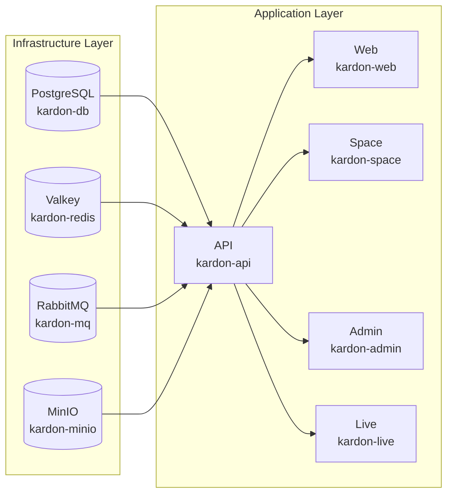

# Docker Compose Setup Guide

Complete guide to set up Kardon using Docker Compose for local development and production deployments.

---

## Table of Contents

1. [Prerequisites](#prerequisites)
2. [Quick Start](#quick-start)
3. [Environment Configuration](#environment-configuration)
4. [Starting Services](#starting-services)
5. [Database Setup](#database-setup)
6. [Service Endpoints](#service-endpoints)
7. [Scaling and Performance](#scaling-and-performance)
8. [Troubleshooting](#troubleshooting)
9. [Production Considerations](#production-considerations)

---

## Prerequisites

### System Requirements

| Resource           | Minimum   | Recommended |
| ------------------ | --------- | ----------- |
| **CPU**            | 4 cores   | 8+ cores    |
| **RAM**            | 16 GB     | 32 GB       |
| **Disk**           | 50 GB SSD | 100+ GB SSD |
| **Docker**         | 24.0+     | 25.0+       |
| **Docker Compose** | 2.20+     | 2.25+       |

### Required Software

```bash
# Check Docker version
docker --version
# Docker version 25.0.0, build 8a3cdc4

# Check Docker Compose version
docker compose version
# Docker Compose version v2.25.0

# Verify Docker is running
docker info
```

### Required Tools

```bash
# Git (for cloning repository)
git --version

# OpenSSL (for generating secure keys)
openssl version

# Make (optional, for build scripts)
make --version
```

---

## Quick Start

### 5-Minute Setup

```bash
# 1. Clone the repository
git clone https://github.com/H3xKatana/microhack-kardon.git
cd microhack-kardon

# 2. Run the automated setup script
bash setup.sh

# 3. Start all services
docker compose -f docker-compose-local.yml up -d

# 4. Verify installation
docker compose ps

# 5. Access the platform
# Open: http://localhost:3000
```

### Manual Setup

```bash
# 1. Clone and navigate
git clone https://github.com/H3xKatana/microhack-kardon.git
cd microhack-kardon

# 2. Copy environment templates
cp .env.example .env
for service in web api space admin live; do
    cp apps/$service/.env.example apps/$service/.env
done

# 3. Generate security keys
SECRET_KEY=$(openssl rand -base64 32)
echo "SECRET_KEY=$SECRET_KEY" >> apps/api/.env

# 4. Enable pnpm and install dependencies
corepack enable pnpm
pnpm install

# 5. Start infrastructure services first
docker compose up -d kardon-db kardon-redis kardon-mq kardon-minio

# 6. Wait for health checks
sleep 10
docker compose ps

# 7. Run database migrations
docker compose run --rm migrator

# 8. Start application services
docker compose up -d web api space admin live
```

---

## Environment Configuration

### Root `.env` File

The root `.env` file configures infrastructure services:

```bash
# =============================================================================
# INFRASTRUCTURE SERVICES
# =============================================================================

# PostgreSQL Database
POSTGRES_USER=kardon
POSTGRES_PASSWORD=secure-password-change-in-production
POSTGRES_DB=kardon
POSTGRES_HOST_AUTH_METHOD=scram-sha-256

# Valkey (Redis-compatible cache)
REDIS_HOST=kardon-redis
REDIS_PORT=6379
REDIS_PASSWORD=secure-redis-password

# RabbitMQ Message Queue
RABBITMQ_HOST=kardon-mq
RABBITMQ_PORT=5672
RABBITMQ_USER=kardon
RABBITMQ_PASSWORD=secure-rabbitmq-password

# MinIO Object Storage
AWS_ACCESS_KEY_ID=minio-access-key
AWS_SECRET_ACCESS_KEY=minio-secret-key
AWS_S3_BUCKET_NAME=kardon-uploads
MINIO_ENDPOINT=minio:9000
MINIO_ROOT_USER=minio-admin
MINIO_ROOT_PASSWORD=secure-minio-password
AWS_DEFAULT_REGION=us-east-1

# =============================================================================
# AI SERVICES - STATE-OF-THE-ART MODELS
# =============================================================================

# Anthropic Claude Opus 4.6 (Enterprise-Grade)
ANTHROPIC_API_KEY=sk-ant-api03-your-key-here
ANTHROPIC_MODEL=claude-opus-4.6-20250201

# OpenAI GPT-5.3-Codex (Latest Coding Model)
OPENAI_API_KEY=sk-your-openai-key-here
OPENAI_MODEL=gpt-5.3-codex

# Kimi 2.5 (Moonshot AI - Cost-Effective)
KIMI_API_KEY=your-kimi-key-here

# MiniMax 2.1 (Coding Specialist)
MINIMAX_API_KEY=your-minimax-key-here

# GLM 4.7 (Zhipu AI - Agentic Coding)
GLM_API_KEY=your-glm-key-here

# =============================================================================
# DEPLOYMENT SETTINGS
# =============================================================================

DOCKERIZED=1
LISTEN_HTTP_PORT=80
LISTEN_HTTPS_PORT=443
```

### API Service `.env` (`apps/api/.env`)

```bash
# =============================================================================
# DJANGO SETTINGS
# =============================================================================

SECRET_KEY=your-generated-secret-key-here
DEBUG=0
DJANGO_SETTINGS_MODULE=kardon.settings.production
ALLOWED_HOSTS=localhost,127.0.0.1,.kardon.local

# =============================================================================
# CORS & SECURITY
# =============================================================================

CORS_ALLOWED_ORIGINS=http://localhost:3000,http://localhost:3001,http://localhost:3002
CSRF_TRUSTED_ORIGINS=http://localhost:3000,http://localhost:3001,http://localhost:3002

# =============================================================================
# SERVICE URLS (INTERNAL DOCKER NETWORKING)
# =============================================================================

ADMIN_BASE_URL=http://admin:3001
SPACE_BASE_URL=http://space:3002
APP_BASE_URL=http://web:3000
LIVE_BASE_URL=http://live:3100
API_BASE_URL=http://api:8000

# =============================================================================
# SECURITY KEYS
# =============================================================================

LIVE_SERVER_SECRET_KEY=your-websocket-secret-key
JWT_SECRET_KEY=your-jwt-secret-key
ENCRYPTION_KEY=32-character-encryption-key-here

# =============================================================================
# FILE UPLOAD LIMITS
# =============================================================================

FILE_SIZE_LIMIT=52428800        # 50MB
ASSET_UPLOAD_MAX_SIZE=104857600 # 100MB

# =============================================================================
# GUNICORN WORKERS
# =============================================================================

GUNICORN_WORKERS=2
```

### Complete Environment Variables Reference

| Variable                  | Required | Description           |
| ------------------------- | -------- | --------------------- |
| **POSTGRES_USER**         | Yes      | PostgreSQL username   |
| **POSTGRES_PASSWORD**     | Yes      | PostgreSQL password   |
| **POSTGRES_DB**           | Yes      | Database name         |
| **REDIS_HOST**            | Yes      | Redis/Valkey hostname |
| **REDIS_PORT**            | Yes      | Redis/Valkey port     |
| **RABBITMQ_HOST**         | Yes      | RabbitMQ hostname     |
| **RABBITMQ_USER**         | Yes      | RabbitMQ username     |
| **RABBITMQ_PASSWORD**     | Yes      | RabbitMQ password     |
| **AWS_ACCESS_KEY_ID**     | Yes      | S3/MinIO access key   |
| **AWS_SECRET_ACCESS_KEY** | Yes      | S3/MinIO secret key   |
| **AWS_S3_BUCKET_NAME**    | Yes      | S3 bucket name        |
| **MINIO_ENDPOINT**        | Yes      | MinIO endpoint        |
| **SECRET_KEY**            | Yes      | Django secret key     |
| **DEBUG**                 | No       | Debug mode (0/1)      |
| **CORS_ALLOWED_ORIGINS**  | Yes      | Allowed CORS origins  |

---

## Starting Services

### Service Startup Order



### Step-by-Step Startup

```bash
# 1. Start infrastructure services first
docker compose up -d kardon-db kardon-redis kardon-mq kardon-minio

# 2. Wait for infrastructure to be healthy
echo "Waiting for PostgreSQL..."
until docker compose exec -T kardon-db pg_isready -U kardon -q; do
    sleep 2
done
echo "PostgreSQL ready!"

echo "Waiting for Redis..."
until docker compose exec -T kardon-redis redis-cli ping | grep -q PONG; do
    sleep 2
done
echo "Redis ready!"

echo "Waiting for RabbitMQ..."
until curl -s http://localhost:15672/api/overview | grep -q "rabbitmq"; do
    sleep 2
done
echo "RabbitMQ ready!"

# 3. Run database migrations
docker compose run --rm migrator

# 4. Start application services
docker compose up -d

# 5. Verify all services are healthy
docker compose ps
```

### One-Command Startup

```bash
# Start all services at once
docker compose -f docker-compose-local.yml up -d

# With logs
docker compose -f docker-compose-local.yml up -d && docker compose logs -f
```

### Stopping Services

```bash
# Stop all services
docker compose down

# Stop and remove volumes (DATA LOSS!)
docker compose down -v

# Stop specific service
docker compose stop web
docker compose start web
```

---

## Database Setup

### Initial Migration

```bash
# Run migrations manually
docker compose exec api python manage.py migrate

# Run with specific database
docker compose exec api python manage.py migrate --database=default

# Create new migration
docker compose exec api python manage.py makemigrations

# Show migration status
docker compose exec api python manage.py showmigrations
```

### Create Superuser

```bash
# Interactive superuser creation
docker compose exec api python manage.py createsuperuser

# Non-interactive (set env variables first)
export DJANGO_SUPERUSER_USERNAME=admin
export DJANGO_SUPERUSER_EMAIL=admin@example.com
export DJANGO_SUPERUSER_PASSWORD=secure-password
docker compose exec api python manage.py createsuperuser --noinput
```

### Seed Initial Data

```bash
# Load initial data fixtures
docker compose exec api python manage.py loaddata initial_data.json

# Load specific fixtures
docker compose exec api python manage.py loaddata groups states labels
```

### Database Backups

```bash
# Create backup
docker compose exec kardon-db pg_dump -U kardon kardon > backup_$(date +%Y%m%d_%H%M%S).sql

# Create compressed backup
docker compose exec kardon-db pg_dump -U kardon kardon | gzip > backup_$(date +%Y%m%d).sql.gz

# Backup to host volume
docker compose exec kardon-db pg_dump -U kardon kardon > backups/daily_backup.sql

# Automated daily backups (add to crontab)
# 0 2 * * * docker compose -f /path/to/docker-compose.yml exec -T kardon-db pg_dump -U kardon kardon | gzip > /backups/kardon_$(date +\%Y\%m\%d).sql.gz
```

### Database Restore

```bash
# Restore from SQL file
docker compose exec -T kardon-db psql -U kardon kardon < backup.sql

# Restore from compressed file
gunzip -c backup.sql.gz | docker compose exec -T kardon-db psql -U kardon kardon

# Restore specific table
docker compose exec -T kardon-db psql -U kardon kardon -c "DROP TABLE IF EXISTS your_table;"
docker compose exec -T kardon-db psql -U kardon kardon < your_table.sql
```

---

## Service Endpoints

### Development Environment

| Service           | URL                             | Port  | Description                   |
| ----------------- | ------------------------------- | ----- | ----------------------------- |
| **Web App**       | http://localhost:3000           | 3000  | Main user interface           |
| **Space App**     | http://localhost:3002           | 3002  | Collaboration spaces          |
| **Admin Panel**   | http://localhost:3001/god-mode  | 3001  | Administration interface      |
| **API Server**    | http://localhost:8000           | 8000  | REST API endpoints            |
| **API Docs**      | http://localhost:8000/api/docs/ | 8000  | Swagger/OpenAPI documentation |
| **Real-Time**     | ws://localhost:3100             | 3100  | WebSocket server              |
| **MinIO Console** | http://localhost:9090           | 9090  | File storage management       |
| **MinIO API**     | http://localhost:9000           | 9000  | S3-compatible API             |
| **RabbitMQ UI**   | http://localhost:15672          | 15672 | Message queue management      |
| **PostgreSQL**    | localhost:5432                  | 5432  | Database connection           |
| **Redis**         | localhost:6379                  | 6379  | Cache connection              |

### Health Check Endpoints

```bash
# API health check
curl http://localhost:8000/health

# Live server health check
curl http://localhost:3100/health

# PostgreSQL health
docker compose exec kardon-db pg_isready -U kardon

# Redis health
docker compose exec kardon-redis redis-cli ping

# RabbitMQ health
curl -u kardon:password http://localhost:15672/api/overview
```

### API Base URLs

| Environment | Base URL                           |
| ----------- | ---------------------------------- |
| Development | http://localhost:8000/api/v1/      |
| Production  | https://api.yourdomain.com/api/v1/ |

---

## Scaling and Performance

### Resource Limits

Add to `docker-compose.yml`:

```yaml
services:
  api:
    deploy:
      resources:
        limits:
          cpus: "2"
          memory: 2G
        reservations:
          cpus: "1"
          memory: 1G

  worker:
    deploy:
      resources:
        limits:
          cpus: "2"
          memory: 4G
```

### Scaling Services

```bash
# Scale web frontend to 3 instances
docker compose up -d --scale web=3

# Scale workers to 4 instances
docker compose up -d --scale worker=4

# Scale with custom limits
docker compose up -d --scale web=2 --scale worker=2

# View scaled services
docker compose ps --all
```

### Performance Tuning

```bash
# Monitor resource usage
docker stats

# View container logs
docker compose logs -f api
docker compose logs -f web

# Check service performance
docker compose exec api python manage.py shell -c "
from django.db import connection
cursor = connection.cursor()
cursor.execute('SELECT version();')
print(cursor.fetchone())
"
```

---

## Troubleshooting

### Common Issues

#### 1. Port Conflicts

```bash
# Check what's using port 3000
lsof -i :3000

# Kill process using port
kill $(lsof -t -i:3000)

# Use different port
PORT=3005 docker compose up -d web
```

#### 2. Database Connection Failed

```bash
# Check database logs
docker compose logs kardon-db

# Verify database is running
docker compose ps | grep kardon-db

# Test connection
docker compose exec kardon-db psql -U kardon -c '\l'

# Restart database
docker compose restart kardon-db
```

#### 3. Container Won't Start

```bash
# Check container logs
docker compose logs api

# Check Docker daemon status
docker info

# Remove stuck containers
docker compose down -v
docker compose up -d
```

#### 4. Memory Issues

```bash
# Check memory usage
docker stats --format "table {{.Name}}\t{{.CPUPerc}}\t{{.MemUsage}}"

# Increase Docker memory limit
# Docker Desktop: Settings > Resources > Memory

# Clean up Docker
docker system prune -a
```

#### 5. Migration Failures

```bash
# Check migration status
docker compose exec api python manage.py showmigrations

# Create migrations
docker compose exec api python manage.py makemigrations

# Run migrations with fake
docker compose exec api python manage.py migrate --fake-initial

# Reset database (DATA LOSS!)
docker compose down -v
docker compose up -d kardon-db
docker compose run --rm migrator
docker compose up -d
```

### Debug Commands

```bash
# Access API container shell
docker compose exec api /bin/bash

# Access database
docker compose exec kardon-db psql -U kardon

# Access Redis CLI
docker compose exec kardon-redis redis-cli

# View all logs
docker compose logs --tail=100

# Follow specific service logs
docker compose logs -f --tail=50 api
```

### Reset Installation

```bash
# Complete reset (DATA LOSS!)
docker compose down -v
docker volume rm $(docker volume ls -q | grep kardon)
rm -rf apps/api/.env apps/web/.env apps/space/.env apps/admin/.env apps/live/.env .env

# Fresh setup
bash setup.sh
docker compose up -d
```

---

## Production Considerations

### Environment Security

```bash
# Generate strong passwords
openssl rand -base64 32  # Secret key
openssl rand -base64 24  # Database password

# Use secrets management in production
# - Docker Swarm Secrets
# - Kubernetes Secrets
# - HashiCorp Vault
```

### Production Docker Compose

Use `docker-compose.yml` (not `docker-compose-local.yml`) for production:

```bash
# Build and start production services
docker compose -f docker-compose.yml build
docker compose -f docker-compose.yml up -d

# With TLS/SSL certificates
docker compose -f docker-compose.prod.yml up -d
```

### Monitoring

```bash
# Enable monitoring endpoint
HEALTHCHECK=true

# View service health
docker compose ps

# Check container health status
docker inspect --format='{{.State.Health.Status}}' kardon-api
```

### Backup Strategy

```bash
# Automated backup script
#!/bin/bash
BACKUP_DIR=/backups
DATE=$(date +%Y%m%d_%H%M%S)

# Database backup
docker compose exec kardon-db pg_dump -U kardon kardon | gzip > $BACKUP_DIR/db_$DATE.sql.gz

# Upload to S3
aws s3 cp $BACKUP_DIR/db_$DATE.sql.gz s3://your-backup-bucket/

# Keep last 30 days
find $BACKUP_DIR -name "*.sql.gz" -mtime +30 -delete
```

---

## Next Steps

1. **Configure AI Models**: Set up API keys for Claude, Kimi, MiniMax, or GLM
2. **Set Up Domain**: Configure DNS for production deployment
3. **Enable SSL**: Set up TLS certificates with Caddy
4. **Configure Backups**: Set up automated backup strategy
5. **Monitoring**: Set up Prometheus and Grafana for monitoring

---

## Additional Resources

- [Architecture Documentation](../architecture/README.md)
- [Security Guidelines](../security/README.md)
- [AI Integration Guide](../ai/README.md)
- [API Documentation](http://localhost:8000/api/docs/)
