# Features Documentation

Overview of current and planned features for the Kardon platform.

---

## Table of Contents

1. [Current Features](#current-features)
2. [Workspace Realtime Chatspace](#workspace-realtime-chatspace)
3. [AI Chat with Multiple Agents](#ai-chat-with-multiple-agents)
4. [Agent Orchestrator](#agent-orchestrator)
5. [Feature Roadmap](#feature-roadmap)

---

## Current Features

### Existing Capabilities

```mermaid
graph TB
    subgraph "Current Features"
        PM[📋 Project Management]
        ISS[🎫 Issue Tracking]
        PAG[📄 Page Collaboration]
        FIL[📎 File Management]
        NOT[🔔 Notifications]
        AUT[🔐 Authentication]
        INT[🔗 Integrations]
        REA[⚡ Real-Time Editing]
    end
```

### Implemented Features

| Category               | Feature        | Status  | Description                     |
| ---------------------- | -------------- | ------- | ------------------------------- |
| **Project Management** | Workspaces     | ✅ Done | Multi-workspace support         |
| **Project Management** | Projects       | ✅ Done | Project creation and management |
| **Project Management** | Modules        | ✅ Done | Module categorization           |
| **Project Management** | Cycles/Sprints | ✅ Done | Time-based planning             |
| **Issue Tracking**     | Issues         | ✅ Done | Full issue lifecycle            |
| **Issue Tracking**     | Comments       | ✅ Done | Issue discussions               |
| **Issue Tracking**     | Labels         | ✅ Done | Categorization                  |
| **Issue Tracking**     | Assignees      | ✅ Done | Responsibility tracking         |
| **Collaboration**      | Pages          | ✅ Done | Rich text documents             |
| **Collaboration**      | Real-time Edit | ✅ Done | Collaborative editing           |
| **File Management**    | Assets         | ✅ Done | File uploads (MinIO)            |
| **File Management**    | Previews       | ✅ Done | Image/file previews             |
| **Notifications**      | In-app         | ✅ Done | Real-time notifications         |
| **Notifications**      | Email          | ✅ Done | Email digests                   |
| **Authentication**     | Session Auth   | ✅ Done | Email/password                  |
| **Authentication**     | OAuth          | ✅ Done | Google, GitHub, GitLab          |
| **Integrations**       | Webhooks       | ✅ Done | Outgoing webhooks               |
| **Integrations**       | Slack          | ✅ Done | Slack integration               |
| **Integrations**       | GitHub         | ✅ Done | GitHub sync                     |

---

## Workspace Realtime Chatspace

### Overview

Real-time messaging platform integrated within workspaces for team communication.

### Architecture

```mermaid
graph TB
    subgraph "Chatspace Architecture"
        subgraph "Frontend"
            CHAT_UI[💬 Chat UI<br/>React Components]
            CHANNELS[📂 Channel List]
            DMS[👤 Direct Messages]
            MSGS[📜 Message History]
            PRESENCE[👥 User Presence]
        end

        subgraph "Real-Time Layer"
            WS[🔌 WebSocket<br/>Connection]
            SUBS[📡 Subscription<br/>Message Topics]
            PRES[👁️ Presence<br/>Online Status]
        end

        subgraph "Backend Services"
            MSG[📨 Message Service<br/>Process Messages]
            CHAN[📂 Channel Service<br/>Manage Channels]
            AUTH[🔐 Chat Auth<br/>Validate Access]
            SEARCH[🔍 Search Service<br/>Full-Text Search]
        end

        subgraph "Data Layer"
            MSG_DB[(Messages<br/>PostgreSQL)]
            CHAN_DB[(Channels<br/>PostgreSQL)]
            PRES_RED[(Presence<br/>Redis)]
            MSG_CACHE[(Cache<br/>Redis)]
        end
    end

    CHAT_UI --> WS
    CHANNELS --> WS
    DMS --> WS
    MSGS --> WS
    PRESENCE --> PRES

    WS --> SUBS & PRES
    SUBS --> MSG & CHAN & AUTH & SEARCH
    MSG --> MSG_DB & PRES_RED & MSG_CACHE
    CHAN --> CHAN_DB
    PRES --> PRES_RED
```

### Channel Types

```mermaid
graph LR
    subgraph "Channel Types"
        PUB[📢 Public Channels<br/>Workspace-wide]
        PRIV[🔒 Private Channels<br/>Invite-only]
        DM[👤 Direct Messages<br/>1:1 Chat]
        GRP[👥 Group Messages<br/>Small Teams]
        THREAD[🧵 Thread Replies<br/>Context Discussions]
    end
```

### Message Features

| Feature               | Description            | Implementation             |
| --------------------- | ---------------------- | -------------------------- |
| **Channels**          | Topic-based chat rooms | PostgreSQL + Redis pub/sub |
| **Direct Messages**   | 1:1 private messaging  | Encrypted storage          |
| **Group Messages**    | Small group chats      | Member management          |
| **Threads**           | Contextual replies     | Parent-child relationships |
| **Reactions**         | Emoji reactions        | Real-time sync             |
| **Mentions**          | @user notifications    | Notification triggers      |
| **File Sharing**      | Drag-and-drop files    | MinIO integration          |
| **Code Blocks**       | Syntax highlighting    | TipTap integration         |
| **Search**            | Full-text search       | PostgreSQL full-text       |
| **Pinned Messages**   | Important messages     | Channel metadata           |
| **Message History**   | Scrollable history     | Infinite scroll            |
| **Read Receipts**     | Message read status    | Redis tracking             |
| **Typing Indicators** | "User is typing..."    | WebSocket broadcast        |
| **Emoji Reactions**   | Quick responses        | Yjs CRDT sync              |

### User Presence System

---

## AI Chat with Multiple Agents

### Overview

Advanced AI chat system featuring multiple specialized agents working together.

### Architecture

```mermaid
graph TB
    subgraph "Multi-Agent AI System"
        subgraph "User Interface"
            CHAT[💬 Chat Interface]
            CONTEXT[📎 Context Panel]
            HISTORY[📜 Chat History]
            TOOLS[🛠️ Tool Selection]
        end

        subgraph "Agent Orchestrator"
            ROUTER[🎯 Request Router]
            CONTEXT[🧠 Context Manager]
            COORD[🤝 Agent Coordinator]
            RESULT[📊 Result Aggregator]
        end

        subgraph "Specialized Agents"
            CODER[💻 Code Agent<br/>Claude/GPT-5.3]
            WRITER[✍️ Writer Agent<br/>GLM/Kimi]
            RESEARCH[🔍 Research Agent<br/>Claude Opus]
            ANALYST[📈 Analyst Agent<br/>MiniMax]
            PLANNER[📋 Planner Agent<br/>Claude Opus]
        end

        subgraph "Agent Communication"
            MSG[📨 Agent Messages]
            STATE[🔄 Shared State]
            TOOLS[🛠️ Tool Calls]
        end

        subgraph "Data Layer"
            CHAT_HIST[(Chat History<br/>PostgreSQL)]
            CONTEXT_V[(Vector DB<br/>Embeddings)]
            AGENT_ST[(Agent State<br/>Redis)]
        end
    end

    CHAT --> ROUTER
    CONTEXT --> CONTEXT
    HISTORY --> ROUTER
    TOOLS --> ROUTER

    ROUTER --> CONTEXT & COORD & RESULT
    CONTEXT --> CONTEXT_V
    COORD --> CODER & WRITER & RESEARCH & ANALYST & PLANNER
    RESULT --> CHAT

    CODER & WRITER & RESEARCH & ANALYST & PLANNER --> MSG & STATE & TOOLS
    MSG & STATE & TOOLS --> CHAT_HIST & CONTEXT_V & AGENT_ST
```

### Agent Types

```mermaid
graph LR
    subgraph "Specialized AI Agents"
        A1[💻 Code Agent<br/>Code generation<br/>Debugging<br/>Code review]
        A2[✍️ Writer Agent<br/>Documentation<br/>Content writing<br/>Rephrasing]
        A3[🔍 Research Agent<br/>Web search<br/>Data analysis<br/>Summarization]
        A4[📈 Analyst Agent<br/>Data insights<br/>Metrics<br/>Forecasting]
        A5[📋 Planner Agent<br/>Task breakdown<br/>Scheduling<br/>Prioritization]
    end

    subgraph "Orchestration"
        ORCH[🎯 Orchestrator<br/>Task assignment<br/>Coordination]
    end

    A1 & A2 & A3 & A4 & A5 --> ORCH
```

### Agent Capabilities Matrix

| Agent              | Primary Skills                     | Best Models               | Use Cases                                  |
| ------------------ | ---------------------------------- | ------------------------- | ------------------------------------------ |
| **Code Agent**     | Code generation, debugging, review | GPT-5.3-Codex, Claude 4.6 | "Write a REST API", "Fix this bug"         |
| **Writer Agent**   | Documentation, content, rephrasing | GLM 4.7, Kimi 2.5         | "Write documentation", "Make it concise"   |
| **Research Agent** | Web search, data gathering         | Claude Opus 4.6           | "Research competitors", "Summarize trends" |
| **Analyst Agent**  | Data analysis, insights            | MiniMax 2.1, Kimi 2.5     | "Analyze metrics", "Create report"         |
| **Planner Agent**  | Task planning, scheduling          | Claude Opus 4.6           | "Plan sprint", "Break down project"        |

### Multi-Agent Collaboration Flow

---

## Agent Orchestrator

### Overview

Central orchestration system that manages AI agents, handles task routing, and ensures efficient collaboration.

### Architecture

### Task Routing Logic

### Agent Coordination

### Performance Metrics

| Metric                | Description                  | Target                               |
| --------------------- | ---------------------------- | ------------------------------------ |
| **Task Latency**      | Time to complete task        | < 30s for simple, < 5min for complex |
| **Agent Utilization** | Agent busy time              | 70-85%                               |
| **Queue Wait Time**   | Time waiting in queue        | < 10s                                |
| **Success Rate**      | Tasks completed successfully | > 95%                                |
| **Retry Rate**        | Tasks requiring retry        | < 5%                                 |
| **Cost per Task**     | Average API cost             | < $0.50                              |

---

## Feature Roadmap

### Development Timeline

### Priority Matrix

| Feature              | Priority | Complexity | Value     | Status      |
| -------------------- | -------- | ---------- | --------- | ----------- |
| Realtime Chat        | High     | Medium     | High      | In Progress |
| Multi-Agent AI       | High     | High       | Very High | Planning    |
| Agent Orchestrator   | High     | Very High  | Very High | Planning    |
| Advanced Search      | Medium   | Medium     | High      | Backlog     |
| Voice/Video          | Medium   | High       | Medium    | Backlog     |
| Calendar Integration | Medium   | Medium     | Medium    | Backlog     |
| Advanced Analytics   | Medium   | Medium     | Medium    | Backlog     |
| Custom Workflows     | Low      | High       | Medium    | Backlog     |

---

## Additional Resources

- [Architecture Overview](../architecture/README.md)
- [Detailed Architecture](../architecture/detailed.md)
- [AI Integration Guide](../ai/README.md)
- [Security Documentation](../security/README.md)

---

## Version History

| Version | Date     | Changes                       |
| ------- | -------- | ----------------------------- |
| 1.0     | Feb 2026 | Initial feature documentation |
| 1.1     | Feb 2026 | Added multi-agent AI details  |
