# Security Documentation

Comprehensive security architecture and compliance guide for the Kardon platform.

---

## Table of Contents

1. [Security Architecture](#security-architecture)
2. [Authentication](#authentication)
3. [Authorization](#authorization)
4. [Data Protection](#data-protection)
5. [GDPR Compliance](#gdpr-compliance)
6. [SOC 2 Compliance](#soc-2-compliance)
7. [Implementation Status](#implementation-status)
8. [Security Hardening](#security-hardening)

---

## Security Architecture

### Defense-in-Depth Model

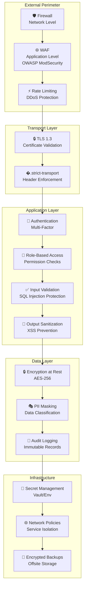

### Security Layers

| Layer              | Protection    | Implementation        |
| ------------------ | ------------- | --------------------- |
| **Network**        | Firewall, WAF | iptables, ModSecurity |
| **Transport**      | TLS 1.3       | Caddy, Let's Encrypt  |
| **Application**    | Auth, RBAC    | Django, Session/JWT   |
| **Data**           | Encryption    | PostgreSQL, MinIO     |
| **Infrastructure** | Secrets       | Docker, Kubernetes    |

---

## Authentication

### Supported Authentication Methods

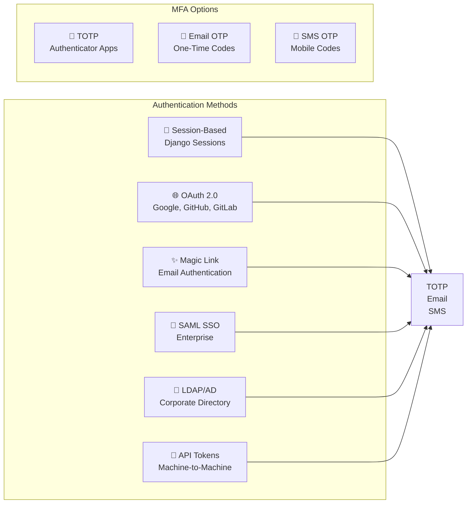

### Authentication Flow

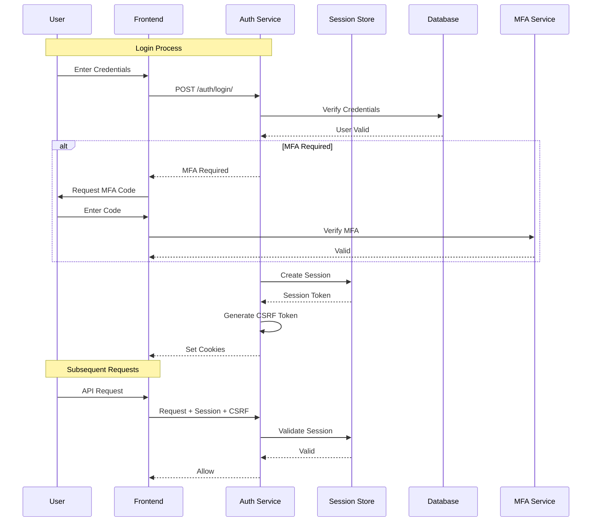

### Session Security

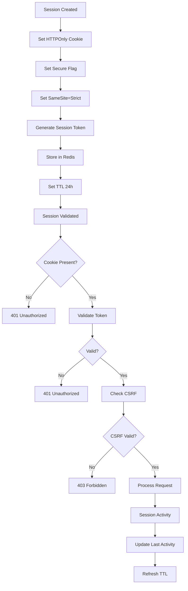

---

## Authorization

### Role-Based Access Control (RBAC)

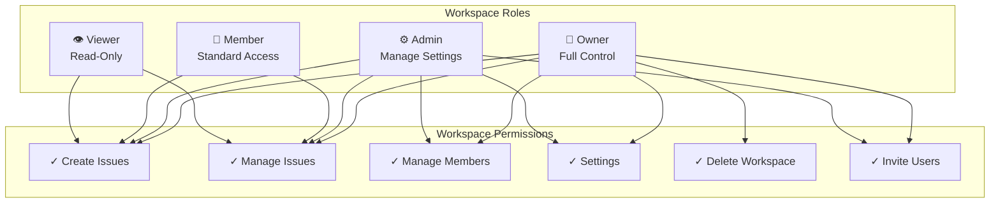

### Permission Matrix

| Permission             | Owner | Admin | Member | Viewer |
| ---------------------- | ----- | ----- | ------ | ------ |
| **View Workspace**     | ✓     | ✓     | ✓      | ✓      |
| **Create Issues**      | ✓     | ✓     | ✓      | ✓      |
| **Edit Issues**        | ✓     | ✓     | ✓      | ✗      |
| **Delete Issues**      | ✓     | ✓     | ✗      | ✗      |
| **Manage Members**     | ✓     | ✓     | ✗      | ✗      |
| **Invite Users**       | ✓     | ✓     | ✗      | ✗      |
| **Workspace Settings** | ✓     | ✓     | ✗      | ✗      |
| **Delete Workspace**   | ✓     | ✗     | ✗      | ✗      |

---

## Data Protection

### Encryption Standards

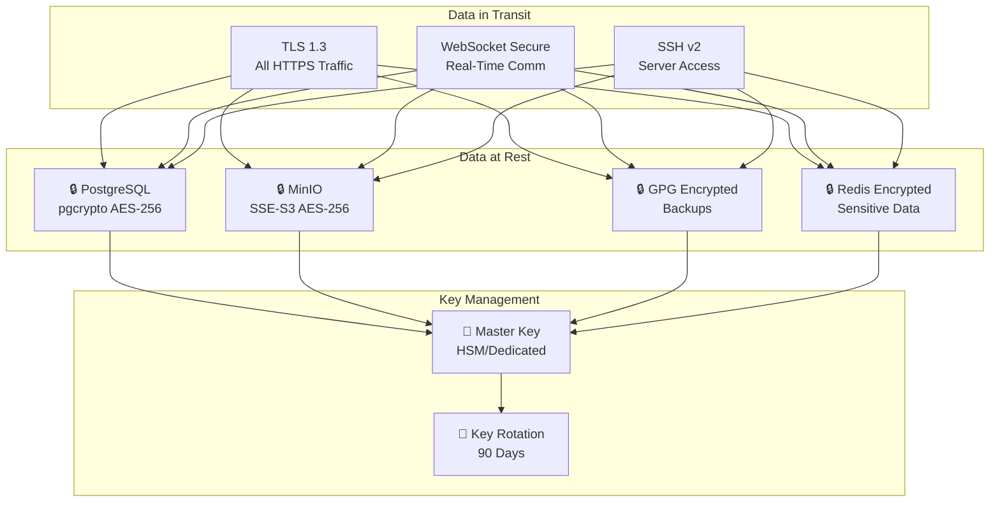

### Encryption Details

| Data State    | Method            | Algorithm      | Key Size |
| ------------- | ----------------- | -------------- | -------- |
| **HTTPS/TLS** | TLS 1.3           | AES-256-GCM    | 256-bit  |
| **Database**  | pgcrypto          | AES-256        | 256-bit  |
| **Files**     | MinIO SSE         | AES-256-SSE-S3 | 256-bit  |
| **Backups**   | GPG               | AES-256        | 256-bit  |
| **Secrets**   | Django SECRET_KEY | PBKDF2         | 256-bit  |

---

## GDPR Compliance

### GDPR Architecture

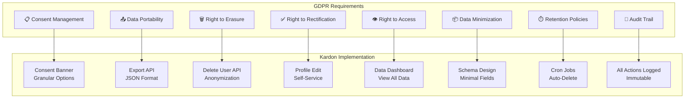

### GDPR Implementation Status

| GDPR Requirement                      | Status     | Implementation | Notes                      |
| ------------------------------------- | ---------- | -------------- | -------------------------- |
| **Lawful Basis**                      | ✅ Done    | Consent model  | Explicit consent required  |
| **Data Minimization**                 | ✅ Done    | Schema design  | Only collect needed data   |
| **Purpose Limitation**                | ✅ Done    | API design     | Clear data usage           |
| **Accuracy**                          | ⚠️ Partial | Self-service   | Manual verification needed |
| **Storage Limitation**                | ⚠️ Partial | Retention API  | Automated cleanup pending  |
| **Integrity & Confidentiality**       | ✅ Done    | Encryption     | AES-256 + TLS 1.3          |
| **Accountability**                    | ⚠️ Partial | Audit logs     | Full audit trail pending   |
| **Right to Access**                   | ✅ Done    | Export API     | Download all user data     |
| **Right to Rectification**            | ✅ Done    | Profile edit   | Self-service               |
| **Right to Erasure**                  | ✅ Done    | Delete API     | Anonymization              |
| **Right to Portability**              | ✅ Done    | Export API     | JSON format                |
| **Right to Object**                   | ❌ Pending | UI needed      | Add opt-out UI             |
| **Automated Decision-Making**         | ✅ N/A     | No profiling   | Not applicable             |
| **Data Protection Impact Assessment** | ❌ Pending | Documentation  | Required for enterprise    |
| **Data Protection Officer**           | ❌ Pending | Designation    | Required for enterprise    |
| **Breach Notification**               | ❌ Pending | Process needed | 72-hour requirement        |

### GDPR Compliance Guide

#### 1. Consent Management

```bash
# Configure consent settings
GDPR_MODE=true
CONSENT_REQUIRED=true
CONSENT_TYPES=essential,analytics,marketing

# User consent options
# - Essential: Required for service (always on)
# - Analytics: Usage tracking (optional)
# - Marketing: Promotional emails (optional)
```

#### 2. Data Export (Right to Access)

```bash
# User exports all their data
curl -X GET http://localhost:8000/api/v1/users/me/export \
  -H "Authorization: Bearer <token>"

# Response includes:
# - Profile data (JSON)
# - Activity history (JSON)
# - Created content (JSON)
# - Settings (JSON)
```

#### 3. Data Deletion (Right to Erasure)

```bash
# User requests deletion
curl -X DELETE http://localhost:8000/api/v1/users/me \
  -H "Authorization: Bearer <token>"

# Deletion process:
# 1. Verify password/authentication
# 2. Export data for legal retention (90 days)
# 3. Anonymize user records
# 4. Delete from active databases
# 5. Queue background cleanup
```

#### 4. Data Retention Policies

```python
# Retention configuration
RETENTION_CONFIG = {
    "active_users": None,  # No limit
    "deleted_users": 2555,  # 7 years (legal)
    "session_logs": 90,     # 90 days
    "audit_logs": 2555,     # 7 years (compliance)
    "temporary_files": 7,   # 7 days
    "backups": 90,          # 90 days (rotation)
}
```

---

## SOC 2 Compliance

### SOC 2 Trust Services Criteria

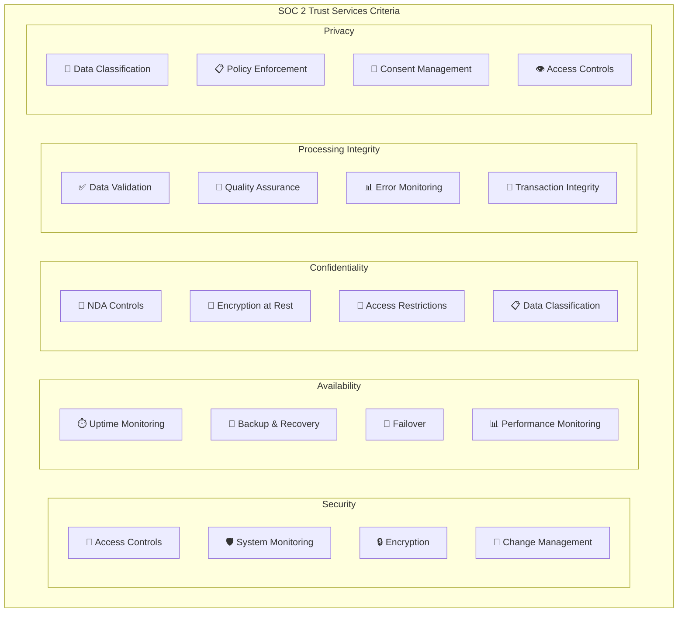

### SOC 2 Implementation Status

| SOC 2 Control                     | Status     | Implementation             | Notes                    |
| --------------------------------- | ---------- | -------------------------- | ------------------------ |
| **CC1.1 - COSO Principle 1**      | ✅ Done    | Security policy documented | Annual review needed     |
| **CC1.2 - COSO Principle 2**      | ✅ Done    | Risk assessment            | Quarterly updates        |
| **CC2.1 - Communication**         | ✅ Done    | Security policies          | Available to users       |
| **CC3.1 - Risk Assessment**       | ✅ Done    | Annual assessment          | Documentation pending    |
| **CC3.2 - Threat Identification** | ✅ Done    | CVE monitoring             | Automated alerts         |
| **CC4.1 - Monitoring**            | ⚠️ Partial | Basic monitoring           | Enhanced SIEM needed     |
| **CC5.1 - Security Policies**     | ✅ Done    | Documented policies        | Annual review            |
| **CC5.2 - Access Management**     | ✅ Done    | RBAC implemented           | Quarterly review         |
| **CC5.3 - System Changes**        | ❌ Pending | Change management          | Process needed           |
| **CC6.1 - Logical Access**        | ✅ Done    | MFA available              | Enforced for admin       |
| **CC6.2 - User Authentication**   | ✅ Done    | Multiple methods           | Session + MFA            |
| **CC6.3 - Access Management**     | ✅ Done    | Provisioning process       | Manual process           |
| **CC7.1 - System Monitoring**     | ⚠️ Partial | Basic logging              | SIEM integration pending |
| **CC7.2 - Anomaly Detection**     | ❌ Pending | Not implemented            | Machine learning needed  |
| **CC8.1 - Change Management**     | ❌ Pending | Not implemented            | ITIL process needed      |
| **A1.1 - Availability Design**    | ✅ Done    | 99.9% SLA                  | Documentation            |
| **A1.2 - Backup & Recovery**      | ✅ Done    | Daily backups              | Tested quarterly         |
| **A1.3 - Incident Response**      | ⚠️ Partial | Basic response             | Playbooks needed         |
| **C1.1 - Confidentiality**        | ✅ Done    | Encryption                 | Data classified          |
| **C1.2 - Data Handling**          | ⚠️ Partial | Policies                   | Training needed          |
| **PI1.1 - Processing Integrity**  | ✅ Done    | Validation                 | Error handling           |
| **PI1.2 - Error Handling**        | ✅ Done    | Logging                    | Alerting pending         |
| **P1.1 - Privacy Notice**         | ✅ Done    | Privacy policy             | Available                |
| **P1.2 - Consent**                | ⚠️ Partial | GDPR mode                  | Enhanced consent UI      |

### SOC 2 Compliance Checklist

#### Security Controls

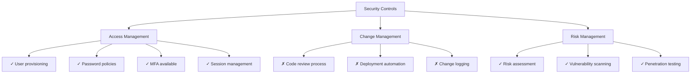

#### Availability Controls

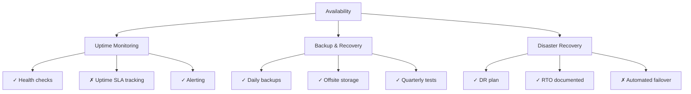

---

## Implementation Status

### Current Implementation Summary

| Category                    | Implemented | Partial | Pending |
| --------------------------- | ----------- | ------- | ------- |
| **Authentication**          | 85%         | 10%     | 5%      |
| **Authorization (RBAC)**    | 90%         | 5%      | 5%      |
| **Encryption**              | 95%         | 0%      | 5%      |
| **Audit Logging**           | 70%         | 20%     | 10%     |
| **GDPR Compliance**         | 60%         | 25%     | 15%     |
| **SOC 2 Compliance**        | 50%         | 25%     | 25%     |
| **Infrastructure Security** | 80%         | 10%     | 10%     |

### Roadmap for Full Compliance

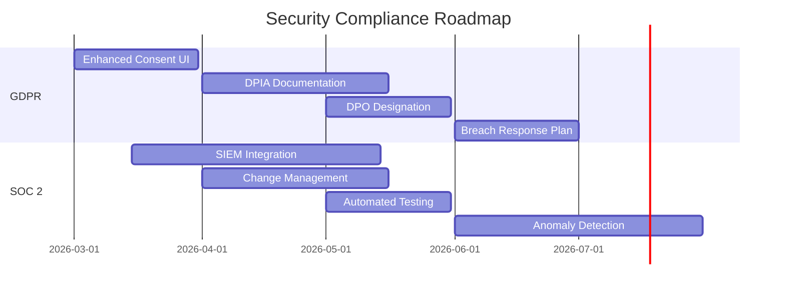

---

## Security Hardening

### Production Checklist

```bash
# =============================================================================
# SECURITY HARDENING CHECKLIST
# =============================================================================

# 1. Change All Default Passwords
#    - PostgreSQL: POSTGRES_PASSWORD
#    - Redis: REDIS_PASSWORD
#    - RabbitMQ: RABBITMQ_PASSWORD
#    - MinIO: MINIO_ROOT_PASSWORD

# 2. Enable TLS/SSL
#    - Configure certificates in Caddy
#    - Force HTTPS redirect
#    - Enable HSTS

# 3. Configure Rate Limiting
#    - Anonymous: 30 requests/minute
#    - Authenticated: 100 requests/minute
#    - API: 1000 requests/minute

# 4. Enable Audit Logging
#    - All API calls logged
#    - Login attempts logged
#    - Data changes logged

# 5. Configure Backup Encryption
#    - GPG encrypt backups
#    - Store offsite
#    - Test quarterly

# 6. Enable MFA
#    - Admin accounts require MFA
#    - Optional for regular users

# 7. Network Security
#    - Firewall rules configured
#    - Only necessary ports exposed
#    - Internal services not exposed

# 8. Regular Updates
#    - Security patches applied
#    - Dependency updates
#    - Certificate renewal
```

### Environment Security Variables

```bash
# =============================================================================
# SECURITY SETTINGS (apps/api/.env)
# =============================================================================

# Session Security
SESSION_COOKIE_SECURE=true
SESSION_COOKIE_HTTPONLY=true
SESSION_COOKIE_SAMESITE=Strict
SESSION_COOKIE_AGE=86400  # 24 hours

# Password Policy
AUTH_PASSWORD_MIN_LENGTH=12
AUTH_PASSWORD_REQUIRE_UPPERCASE=true
AUTH_PASSWORD_REQUIRE_LOWERCASE=true
AUTH_PASSWORD_REQUIRE_NUMBERS=true
AUTH_PASSWORD_REQUIRE_SPECIAL=true
AUTH_MAX_LOGIN_ATTEMPTS=5
AUTH_LOCKOUT_DURATION=900  # 15 minutes

# MFA Settings
MFA_ENABLED=true
MFA_REQUIRED_FOR_ADMIN=true
MFA_ISSUER_NAME=Kardon

# Audit Logging
AUDIT_LOG_ENABLED=true
AUDIT_LOG_RETENTION_DAYS=2555  # 7 years
AUDIT_LOG_IP_ADDRESS=true
AUDIT_LOG_USER_AGENT=true
```

---

## Additional Resources

- [Architecture Overview](../architecture/README.md)
- [Docker Deployment](../deployment/docker-compose/README.md)
- [AI Integration](../ai/README.md)

---

## Version History

| Version | Date     | Changes                        |
| ------- | -------- | ------------------------------ |
| 1.0     | Feb 2026 | Initial security documentation |
